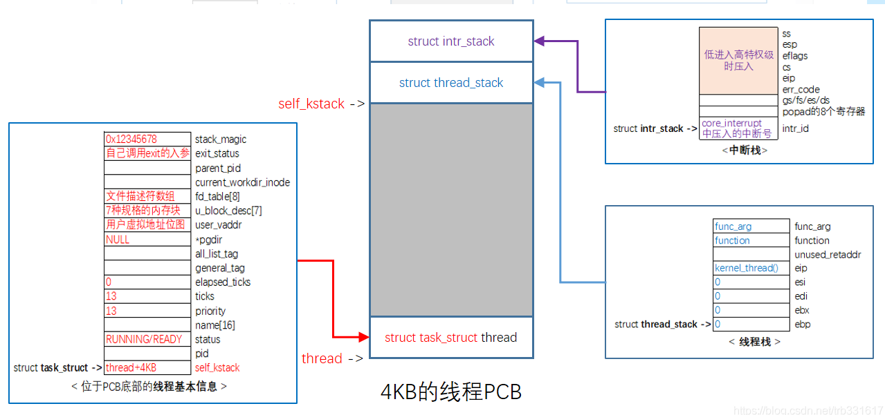
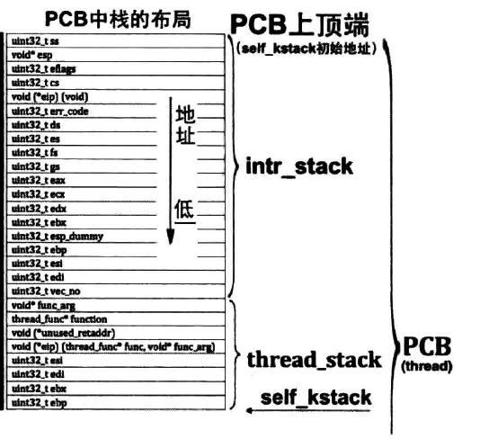
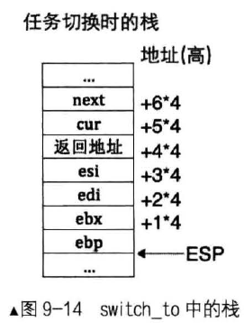
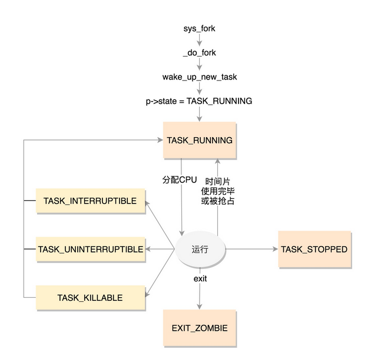
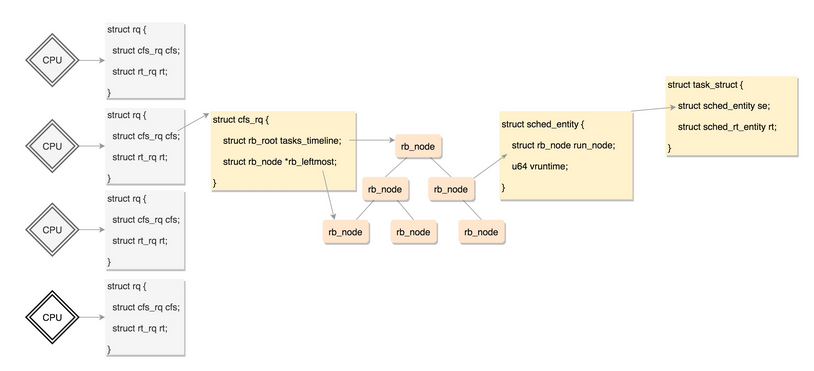

# HuSharp OS 中的调度流程




> 为什么需要单独的进程内核栈？
>
> - 所有进程运行的时候，都可能通过系统调用陷入内核态继续执行。假设第一个进程 A 陷入内核态执行的时候，需要等待读取网卡的数据，主动调用 `schedule()` 让出 CPU；此时调度器唤醒了另一个进程 B，碰巧进程 B 也需要系统调用进入内核态。那问题就来了，如果内核栈只有一个，那进程 B  进入内核态的时候产生的压栈操作，必然会破坏掉进程 A 已有的内核栈数据；一但进程 A 的内核栈数据被破坏，很可能导致进程 A  的内核态无法正确返回到对应的用户态了；

分为两部分完成：

受中断影响，用户态进入内核态，再在内核态中执行中断处理程序-->调用 switch_to 

1、进入中断时的保护，保存进程的全部寄存器映像

2、保护内核环境上下文。

> intr_stack 用于存储进入中断时任务的上下文（相当于 中断栈）
>
> - intr%1entry 执行的保存程序上下文环境的一系列 push 都是压入此结构
> - intr_exit 是该栈的 pop 
> - 位于 PCB 所在最顶端
>
> thread_stack 用于存储中断处理程序中，任务切换 (switch_to )的上下文。（相当于 Linux 中的线程栈）
>
> - 此栈用来保存待运行的函数
> - 发生任务切换时，eip 用于保存切换任务后新任务的返回地址



1) 基于时钟中断的任务调度, 时钟的中断处理程序 intr_timer_handler()
   处理器进入 0 特权级时, 会自动在任务状态段 TSS 中获得 0 特权级的栈地址, 即 current 线程 PCB 顶部的struct intr_stack
   中断的入口 intr_%1_entry 会执行一系列压栈操作(FILE: kernel/interrupt.S), 
   (若是从低特权级进入高特权级, 还会自动压栈: ss esp eflags cs eip err)
2) (此时是current的PCB) 函数 schedule() 中,  若 next 为进程则修改TSS的esp0(next被中断时使用, 这里还是current的), 然后调用 switch_to(current_thread, next), 将自动在PCB顶部继续压栈(可参考struct thread_stack): 
        next current_thread eip/retaddr(这里的eip指向的是函数schedule()中switch_to的下一条指令代码)
3) switch_to()

   1. (此时是current的PCB) 继续压栈: esi edi ebx ebp

   2. (为current保存esp到PCB底部) 从[esp+5*4]处得到栈中参数 current_thread(即 PCB 底部), 

   3. 再mov [eax], esp（这是由于 kstack 位于 PCB 底部）

   4. (切换esp为next的esp----->切换栈) 从[esp+6*4]处得到栈中参数next(即PCB底部, PCB底部保存的是esp值), 再mov esp, [eax]  （这是由于 kstack 位于 PCB 底部）

   5. (此时是 next 的PCB) 出栈: ebp ebx edi esi

   6. (利用ret自动从栈中弹出给 eip 的特性实现执行流的切换) ret

       - 若该任务是第一次执行, 则此时 eip 为kernel_thread()函数(这是在thread_create()函数中初始化的)
                               执行 kernel_thread() 时会将栈中的 2 个值当作其参数 function 和 arg , 执行 function(arg);
                               (栈中的function和arg也是在thread_create()中初始化的)
         - 若为线程, function为直接线程函数;
         - 若为进程, function为start_process(), arg为进程程序
       - 若该任务并非第一次执行, 则此时 eip 指向的是函数 schedule() 中 switch_to 的下一条指令代码(类似于这里的current)
              而 switch_to 是 schedule 最后一句代码, 因此执行流程马上回到 schedule 的调用者intr_timer_handler中
              schedule 也是 intr_timer_handler 中最后一句代码, 因此会回到 interrupt.S 中的 jmp intr_exit, 
              从而恢复任务的全部寄存器映像, 之后通过 iretd 指令退出中断, 任务被完全彻底恢复

       

> 时间被分成”片(slice)”, 给每个可运行进程分配一片CPU时间片, 当然单处理器在任何给定的时刻只能运行一个进程.
>
> 如果当前可运行进程的时限(quantum)到期时(即时间片用尽), 而该进程还没有运行完毕, 进程切换就可以发生.
>
> 分时依赖于定时中断, 因此对进程是透明的, 不需要插入额外的代码来保证CPU分时.
>
> 这也是HuSharpOS 的实现策略


# Linux中的调度相关

[Linux进程调度器的设计](https://blog.csdn.net/gatieme/article/details/51702662)

**调度器**任务是在程序之间共享CPU时间, 创造并行执行的错觉, 该任务分为两个不同的部分, 其中一个涉及**调度策略**, 另外一个涉及**上下文切换**.

## 1、Linux进程调度的目标

　　　　1.高效性：高效意味着在相同的时间下要完成更多的任务。调度程序会被频繁的执行，所以调度程序要尽可能的高效；

　　　　2.加强交互性能:在系统相当的负载下，也要保证系统的响应时间；

　　　　3.保证公平和避免饥渴；

　　　　4.SMP调度：调度程序必须支持多处理系统；

　　　　5.软实时调度：系统必须有效的调用实时进程，但不保证一定满足其要求；

## 2、任务状态

### 5个互斥状态

------

state 域能够取 5个互斥的值（通俗一点就是这五个值任意两个不能一起使用，只能单独使用）。系统中的每个进程都必然处于以上所列进程状态中的一种。

| 状态                 | 描述                                                         |
| -------------------- | ------------------------------------------------------------ |
| TASK_RUNNING         | 表示进程要么正在执行，要么正要准备执行（已经就绪），正在等待cpu时间片的调度 |
| TASK_INTERRUPTIBLE   | 进程因为等待一些条件而被挂起（阻塞）而所处的状态。这些条件主要包括：硬中断、资源、一些信号……，一旦等待的条件成立，进程就会从该状态（阻塞）迅速转化成为就绪状态TASK_RUNNING |
| TASK_UNINTERRUPTIBLE | 意义与TASK_INTERRUPTIBLE类似，除了不能通过接受一个信号来唤醒以外，对于处于TASK_UNINTERRUPIBLE状态的进程，哪怕我们传递一个信号或者有一个外部中断都不能唤醒他们。只有它所等待的资源可用的时候，他才会被唤醒。这个标志很少用，但是并不代表没有任何用处，其实他的作用非常大，特别是对于驱动刺探相关的硬件过程很重要，这个刺探过程不能被一些其他的东西给中断，否则就会让进城进入不可预测的状态 |
| TASK_STOPPED         | 进程被停止执行，当进程接收到SIGSTOP、SIGTTIN、SIGTSTP或者SIGTTOU信号之后就会进入该状态 |
| TASK_TRACED          | 表示进程被debugger等进程监视，进程执行被调试程序所停止，当一个进程被另外的进程所监视，每一个信号都会让进城进入该状态 |




TASK_RUNNING 并不是说进程正在运行，而是表示进程在时刻准备运行的状态。当处于这个状态的进程获得时间片的时候，就是在运行中；如果没有获得时间片，就说明它被其他进程抢占了，在等待再次分配时间片。


在运行中的进程，一旦要进行一些 I/O 操作，需要等待 I/O 完毕，这个时候会释放 CPU，进入睡眠状态。

在 Linux 中，有**两种睡眠状态**。

一种是**TASK_INTERRUPTIBLE**，**可中断的睡眠状态**。这是一种浅睡眠的状态，也就是说，虽然在睡眠，等待 I/O  完成，但是这个时候一个信号来的时候，进程还是要被唤醒。只不过唤醒后，不是继续刚才的操作，而是进行信号处理。当然程序员可以根据自己的意愿，来写信号处理函数，例如收到某些信号，就放弃等待这个 I/O 操作完成，直接退出，也可也收到某些信息，继续等待。

另一种睡眠是**TASK_UNINTERRUPTIBLE**，**不可中断的睡眠状态**。这是一种深度睡眠状态，不可被信号唤醒，只能死等 I/O 操作完成。一旦 I/O 操作因为特殊原因不能完成，这个时候，谁也叫不醒这个进程了。你可能会说，我 kill 它呢？别忘了，kill  本身也是一个信号，既然这个状态不可被信号唤醒，kill 信号也被忽略了。除非重启电脑，没有其他办法。

于是，我们就有了一种新的进程睡眠状态，**TASK_KILLABLE，可以终止的新睡眠状态**。进程处于这种状态中，它的运行原理类似 TASK_UNINTERRUPTIBLE，只不过可以响应致命信号。

TASK_STOPPED 是在进程接收到 SIGSTOP、SIGTTIN、SIGTSTP 或者 SIGTTOU 信号之后进入该状态。

TASK_TRACED 表示进程被 debugger 等进程监视，进程执行被调试程序所停止。当一个进程被另外的进程所监视，每一个信号都会让进程进入该状态。


## 3、优先级

　　进程提供了两种优先级，一种是普通的进程优先级，第二个是实时优先级。前者适用SCHED_NORMAL调度策略，后者可选SCHED_FIFO或SCHED_RR调度策略。**任何时候，实时进程的优先级都高于普通进程**，实时进程只会被更高级的实时进程抢占，同级实时进程之间是按照FIFO（一次机会做完）或者RR（多次轮转）规则调度的。

```c
int prio, static_prio, normal_prio;
unsigned int rt_priority;12
```

| 字段        | 描述                                               |
| ----------- | -------------------------------------------------- |
| static_prio | 用于保存静态优先级，可以通过nice系统调用来进行修改 |
| rt_priority | 用于保存实时优先级                                 |
| normal_prio | 值取决于静态优先级和调度策略                       |
| prio        | 用于保存动态优先级                                 |


## 4、调度策略与调度类

### 进程类型

一种称为**实时进程**，也就是需要尽快执行返回结果的那种。这就好比我们是一家公司，接到的客户项目需求就会有很多种。有些客户的项目需求比较急，比如一定要在一两个月内完成的这种，客户会加急加钱，那这种客户的优先级就会比较高。

另一种是**普通进程**，大部分的进程其实都是这种。这就好比，大部分客户的项目都是普通的需求，可以按照正常流程完成，优先级就没实时进程这么高，但是人家肯定也有确定的交付日期。


## 1、调度策略选择 policy

在 task_struct 中，有一个成员变量，我们叫**调度策略**。 

调度策略(scheduling policy)的任务就是决定什么时候以怎么样的方式选择一个新进程占用CPU运行.

> 传统操作系统的调度基于分时(time sharing)技术: 多个进程以”时间多路服用”方式运行, 因为CPU的时间被分成”片(slice)”, 给每个可运行进程分配一片CPU时间片, 当然单处理器在任何给定的时刻只能运行一个进程.
>
> 如果当前可运行进程的时限(quantum)到期时(即时间片用尽), 而该进程还没有运行完毕, 进程切换就可以发生.
>
> 分时依赖于定时中断, 因此对进程是透明的, 不需要在承租中插入额外的代码来保证CPU分时.
>
> 这也是HuSharpOS 的实现策略

```
unsigned int policy;
```

类型如下

```c
#define SCHED_NORMAL		0
#define SCHED_FIFO		1
#define SCHED_RR		2
#define SCHED_BATCH		3
#define SCHED_IDLE		5
#define SCHED_DEADLINE		6
```

配合调度策略的，还有我们刚才说的**优先级**，也在 task_struct 中。 

```
	int prio, static_prio, normal_prio;
	unsigned int rt_priority;
```

优先级其实就是一个数值，对于实时进程，优先级的范围是 0～99；对于普通进程，优先级的范围是 100～139。**数值越小，优先级越高**。从这里可以看出，所有的实时进程都比普通进程优先级要高。

### 1、实时调度策略 prio

**SCHED_FIFO、SCHED_RR、SCHED_DEADLINE**

1. **SCHED_FIFO**就是交了相同钱的，先来先服务，有的可以分配更高的优先级，也就是说，高优先级的进程可以抢占低优先级的进程，而相同优先级的进程，我们遵循先来先得。
2. **SCHED_RR 轮流调度算法**，采用时间片，相同优先级的任务当用完时间片会被放到队列尾部，以保证公平性，而高优先级的任务也是可以抢占低优先级的任务。
3. **SCHED_DEADLINE**，是按照任务的 deadline 进行调度的。当产生一个调度点的时候，DL 调度器总是选择其 deadline 距离当前时间点最近的那个任务，并调度它执行。

> SHCED_RR和SCHED_FIFO的不同：
>
> - 当采用SHCED_RR策略的进程的时间片用完，系统将重新分配时间片，并置于就绪队列尾。放在队列尾保证了所有具有相同优先级的RR任务的调度公平。  
> -  SCHED_FIFO一旦占用cpu则一直运行。一直运行直到有更高优先级任务到达或自己放弃 。如果有相同优先级的实时进程（根据优先级计算的调度权值是一样的）已经准备好，FIFO时必须等待该进程主动放弃后才可以运行这个优先级相同的任务。而RR可以让每个任务都执行一段时间。

### 2、普通调度策略

既然大家的项目都没有那么紧急，就应该按照普通的项目流程，公平地分配人员。

**SCHED_NORMAL、SCHED_BATCH、SCHED_IDLE**

1. **SCHED_NORMAL** 是普通的进程
2. **SCHED_BATCH** 是后台进程，几乎不需要和前端进行交互。这类项目可以默默执行，不要影响需要交互的进程，可以降低他的优先级。
3. **SCHED_IDLE** 是特别空闲的时候才跑的进程，相当于咱们学习训练类的项目，比如咱们公司很长时间没有接到外在项目了，可以弄几个这样的项目练练手。


## 2、调度类

上面无论是 policy 还是 priority，都设置了一个变量，变量仅仅表示了应该这样这样干，但事情总要有人去干，谁呢？在 task_struct 里面，还有这样的成员变量：

```
const struct sched_class *sched_class;
```

**调度策略的执行逻辑，就封装在这里面，它是真正干活的那个。**

sched_class 有几种实现：

- stop_sched_class 优先级最高的任务会使用这种策略，**会中断所有其他线程，且不会被其他任务打断；**
- dl_sched_class 就对应上面的 deadline 调度策略；
- rt_sched_class 就对应 RR 算法或者 FIFO 算法的调度策略，具体调度策略由进程的 task_struct->policy 指定；
- fair_sched_class 就是普通进程的调度策略；
- idle_sched_class 就是空闲进程的调度策略。

而且由于咱们平时常遇到的都是普通进程，在这里，咱们就重点分析普通进程的调度问题。

### 完全公平调度算法 CFS	

普通进程使用的调度策略是 fair_sched_class，顾名思义，对于普通进程来讲，公平是最重要的。

CFS 全称 Completely Fair Scheduling，叫完全公平调度。

> 首先，你需要记录下进程的运行时间。CPU 会提供一个时钟，过一段时间就触发一个时钟中断。就像咱们的表滴答一下，这个我们叫 Tick。CFS 会为每一个进程安排一个虚拟运行时间 vruntime。如果一个进程在运行，随着时间的增长，也就是一个个 tick 的到来，进程的  vruntime 将不断增大。没有得到执行的进程 vruntime 不变。
>
> 显然，那些 vruntime 少的，原来受到了不公平的对待，需要给它补上，所以会优先运行这样的进程。
>
> 这有点像让你把一筐球平均分到 N 个口袋里面，你看着哪个少，就多放一些；哪个多了，就先不放。这样经过多轮，虽然不能保证球完全一样多，但是也差不多公平。
>
> 你可能会说，不还有优先级呢？如何给优先级高的进程多分时间呢？
>
> 这个简单，就相当于 N 个口袋，优先级高的袋子大，优先级低的袋子小。这样球就不能按照个数分配了，要按照比例来，大口袋的放了一半和小口袋放了一半，里面的球数目虽然差很多，也认为是公平的。

在这里得到当前的时间，以及这次的时间片开始的时间，两者相减就是这次运行的时间 delta_exec ，但是得到的这个时间其实是实际运行的时间，需要做一定的转化才作为虚拟运行时间 vruntime。转化方法如下：

​	` 虚拟运行时间 vruntime += 实际运行时间 delta_exec * NICE_0_LOAD/ 权重 `

同样的实际运行时间，给高权重的算少了，低权重的算多了，但是当选取下一个运行进程的时候，还是按照最小的 vruntime 来的，**这样高权重的获得的实际运行时间自然就多了。**相当于给一个体重 (权重)200 斤的胖子吃两个馒头，和给一个体重 100 斤的瘦子吃一个馒头，然后说，你们两个吃的是一样多。这样虽然总体胖子比瘦子多吃了一倍，但是还是公平的。

#### 调度队列与调度实体

看来 CFS 需要一个数据结构来对 vruntime  进行排序，找出最小的那个。这个能够排序的数据结构不但需要查询的时候，能够快速找到最小的，更新的时候也需要能够快速的调整排序，要知道  vruntime 可是经常在变的，变了再插入这个数据结构，就需要重新排序。

能够平衡查询和更新速度的是树，在这里使用的是红黑树。

**红黑树的的节点是应该包括 vruntime 的，称为调度实体。**

> 调度实体举例
>
> 在 task_struct 中有这样的成员变量
>
> ```c
> struct sched_entity se;
> struct sched_rt_entity rt;
> struct sched_dl_entity dl;
> ```
>
> 这里有实时调度实体 sched_rt_entity，Deadline 调度实体 sched_dl_entity，以及完全公平算法调度实体 sched_entity。
>
> 看来不光 CFS 调度策略需要有这样一个数据结构进行排序，其他的调度策略也同样有自己的数据结构进行排序，因为任何一个策略做调度的时候，都是要区分谁先运行谁后运行。
>
> 而进程根据自己是实时的，还是普通的类型，通过这个成员变量，将自己挂在某一个数据结构里面，和其他的进程排序，等待被调度。如果这个进程是个普通进程，则通过 sched_entity，将自己挂在这棵红黑树上。

对于普通进程的调度实体定义如下，这里面包含了 vruntime 和权重 load_weight，以及对于运行时间的统计。

```c
struct sched_entity {
	struct load_weight	load;		/* for load-balancing */
	struct rb_node		run_node;
	struct list_head	group_node;
	unsigned int		on_rq;

	u64			exec_start;
	u64			sum_exec_runtime;
	u64			vruntime;
	u64			prev_sum_exec_runtime;
	u64			nr_migrations;
    ...
};
```

类似下图


**这棵红黑树放在那里呢？**

- CPU 也是这样的，每个 CPU 都有自己的 struct rq 结构，其用于描述在此 CPU 上所运行的所有进程，其包括一个**实时进程队列  rt_rq 和一个 CFS 运行队列 cfs_rq**
- 在调度时，调度器首先会先去实时进程队列找是否有实时进程需要运行，如果没有才会去 CFS  运行队列找是否有进行需要运行。

每个 CPU 都有自己的实时 struct rq 结构:

```c
struct rq {
	/* runqueue lock: */
	raw_spinlock_t lock;
	unsigned int nr_running;
	unsigned long cpu_load[CPU_LOAD_IDX_MAX];
......
	struct load_weight load;
	unsigned long nr_load_updates;
	u64 nr_switches;

	struct cfs_rq cfs;
	struct rt_rq rt;
	struct dl_rq dl;
......
	struct task_struct *curr, *idle, *stop;
......
};
```

对于普通进程公平队列 cfs_rq，定义如下：

```c
/* CFS-related fields in a runqueue */
struct cfs_rq {
	struct load_weight load;
	unsigned int nr_running, h_nr_running;

	u64 exec_clock;
	u64 min_vruntime;
#ifndef CONFIG_64BIT
	u64 min_vruntime_copy;
#endif
	struct rb_root tasks_timeline;
	struct rb_node *rb_leftmost;

	struct sched_entity *curr, *next, *last, *skip;
......
};
```

这里面 rb_root 指向的就是红黑树的根节点，这个红黑树在 CPU 看起来就是一个队列，不断的取下一个应该运行的进程。rb_leftmost 指向的是最左面的节点。




#### 调度类工作过程

调度类的定义如下：

```c
struct sched_class {
	const struct sched_class *next;
```

next 是一个指针，指向下一个调度类。

这里我们以调度最常见的操作，**取下一个任务**为例，来解析一下。

`注意第一个成员变量，是一个指针，指向下一个调度类。`

上面我们讲了，调度类分为下面这几种：

```c
extern const struct sched_class stop_sched_class;
extern const struct sched_class dl_sched_class;
extern const struct sched_class rt_sched_class;
extern const struct sched_class fair_sched_class;
extern const struct sched_class idle_sched_class;
```

调度的时候是从优先级最高的调度类到优先级低的调度类，依次执行。而对于每种调度类，有自己的实现，例如，CFS 就有 fair_sched_class。

不同的调度类操作不同的队列。在每个 CPU 上都有一个队列 rq，这个队列里面包含的便是不同调度类所对应的子队列。


## 总结CFS

在每个 CPU 上都有一个队列 rq，这个队列里面包含多个子队列，例如 rt_rq 和 cfs_rq，不同的队列有不同的实现方式，cfs_rq 就是用红黑树实现的。

当有一天，某个 CPU 需要找下一个任务执行的时候，**会按照优先级依次调用调度类**，不同的调度类操作不同的队列。当然 rt_sched_class  会先被调用，它会在 rt_rq 上找下一个任务，只有找不到的时候，才轮到 fair_sched_class 被调用，它会在 cfs_rq  上找下一个任务。这样保证了实时任务的优先级永远大于普通任务。

然后从 cfs_rq 中去 CFS 调度类所构成的红黑树中里面取最左面的节点。


### 查看调度 chrt

```shell
husharp@hjh-Ubuntu:~$ chrt -p 32
pid 32 当前的调度策略︰ SCHED_OTHER
pid 32 的当前调度优先级：0
```


## 作业调度算法：

 (1)先来先服务算法
 (2)段作业优先调度算法
 (3)优先级调度算法
 (4)时间片轮转调度算法
 (5)最高响应比优先调度算法
 响应比=周转时间/作业执行时间=(作业执行时间+作业等待时间)/作业执行时间=1+作业等待时间/作业执行时间；
 作业周转时间=作业完成时间-作业到达时间
 (6)多级反馈队列调度算法
 1、进程在进入待调度的队列等待时，首先进入优先级最高的Q1等待。
 2、首先调度优先级高的队列中的进程。若高优先级中队列中已没有调度的进程，则调度次优先级队列中的进程。例如：Q1,Q2,Q3三个队列，只有在Q1中没有进程等待时才去调度Q2，同理，只有Q1,Q2都为空时才会去调度Q3。
 3、对于同一个队列中的各个进程，按照时间片轮转法调度。比如Q1队列的时间片为N，那么Q1中的作业在经历了N个时间片后若还没有完成，则进入Q2队列等待，若Q2的时间片用完后作业还不能完成，一直进入下一级队列，直至完成。
 4、在低优先级的队列中的进程在运行时，又有新到达的作业，那么在运行完这个时间片后，CPU马上分配给新到达的作业（抢占式）。
 (7)实时调度算法
 A、最早截止时间优先调度算法
 B、最低松弛度优先调度算法
  种算法是根据任务紧急的程度，来确定任务的优先级。比如说，一个任务在200ms时必须完成而它本身运行需要100ms，所以此任务就必须在100ms之前调度执行，此任务的松弛度就是100ms。在实现此算法时需要系统中有一个按松弛度排序的实时任务就绪队列，松弛度最低的任务排在最烈的最前面，调度程序总是选择就粗队列中的首任务执行！(可理解为最早额定开始)


