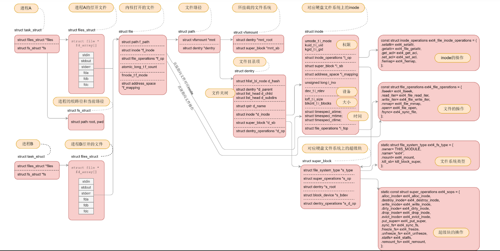
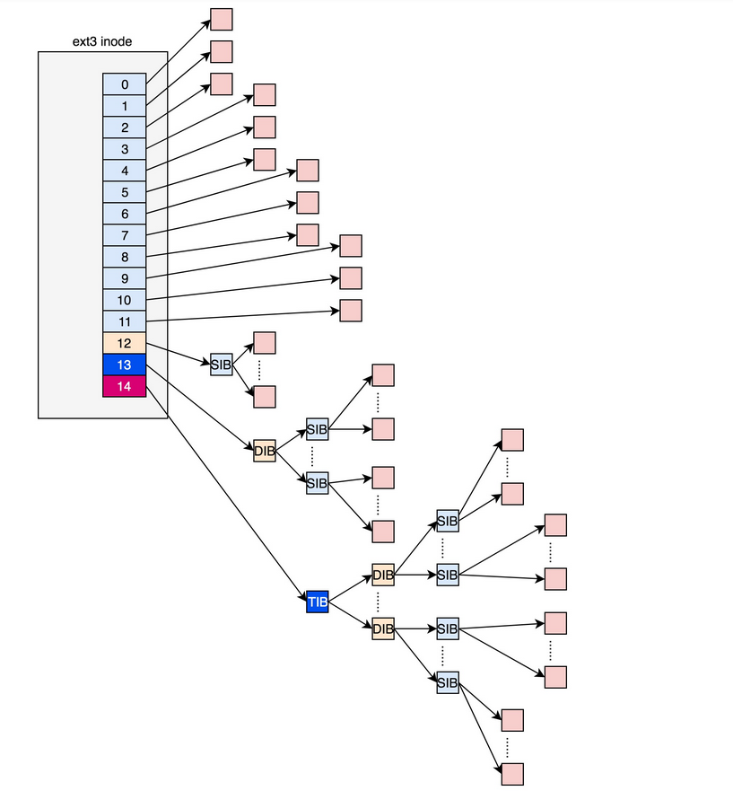
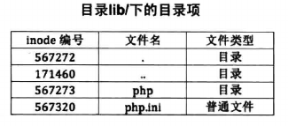
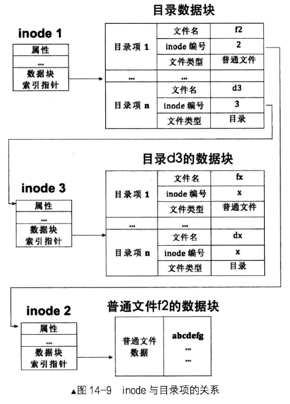
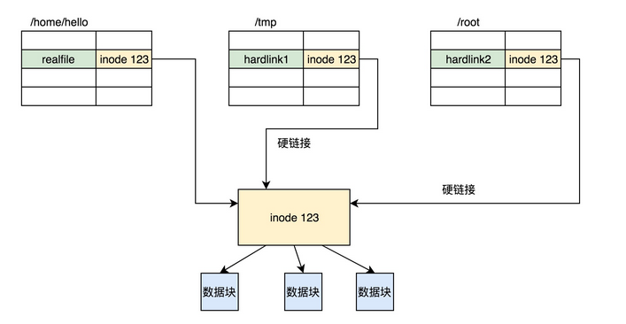
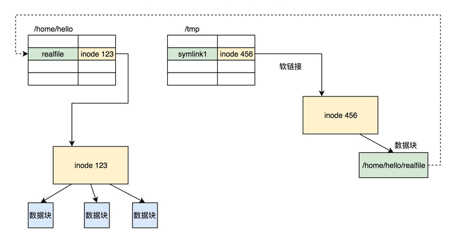
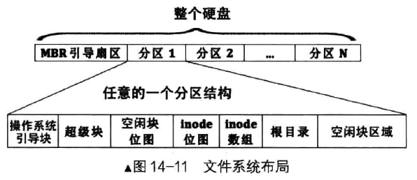
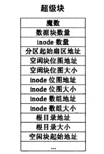
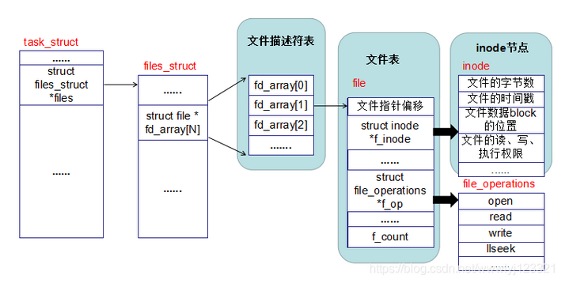
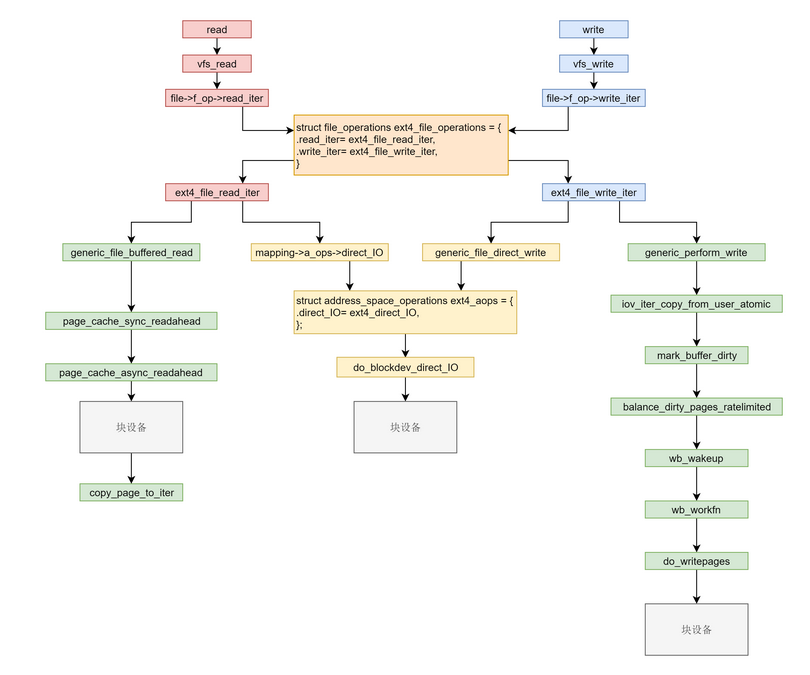

# 文件系统

## 总览



对于每一个进程，打开的文件都有一个文件描述符，在 files_struct  里面会有文件描述符数组。每个一个文件描述符是这个数组的下标，里面的内容指向一个 file 结构，表示打开的文件。这个结构里面有这个文件对应的  inode，最重要的是这个文件对应的操作 file_operation。如果操作这个文件，就看这个 file_operation 里面的定义了。

对于每一个打开的文件，都有一个 dentry 对应，虽然叫作 directory entry，但是不仅仅表示文件夹，也表示文件。它最重要的作用就是指向这个文件对应的 inode。

如果说 file 结构是一个文件打开以后才创建的，dentry 是放在一个 dentry cache 里面的，文件关闭了，他依然存在，因而他可以更长期的维护内存中的文件的表示和硬盘上文件的表示之间的关系。

inode 结构就表示硬盘上的 inode，包括块设备号等。

几乎每一种结构都有自己对应的 operation 结构，里面都是一些方法，因而当后面遇到对于某种结构进行处理的时候，如果不容易找到相应的处理函数，就先找这个 operation 结构，就清楚了。


### 思考

对于运行的进程来说，内存就像一个纸箱子，仅仅是一个暂存数据的地方，而且空间有限。如果我们想要进程结束之后，数据依然能够保存下来，就不能只保存在内存里，而是应该保存在外部存储中。

我们最常用的外部存储就是硬盘，数据是以文件的形式保存在硬盘上的。为了管理这些文件，我们在规划文件系统的时候，需要考虑到以下几点。

**第一点，文件系统要有严格的组织形式，使得文件能够以块为单位进行存储**。

**第二点，文件系统中也要有索引区，用来方便查找一个文件分成的多个块都存放在了什么位置**。

**第三点，如果文件系统中有的文件是热点文件，近期经常被读取和写入，文件系统应该有缓存层**。

**第四点，文件应该用文件夹的形式组织起来，方便管理和查询**。

**第五点，Linux 内核要在自己的内存里面维护一套数据结构，来保存哪些文件被哪些进程打开和使用**。


ls -l 的结果的第一位标识位看出来。

- \- 表示普通文件；
- d 表示文件夹；
- c 表示字符设备文件；
- b 表示块设备文件；
- s 表示套接字 socket 文件；
- l 表示符号链接，也即软链接，就是通过名字指向另外一个文件，例如下面的代码，instance 这个文件就是指向了 /var/lib/cloud/instances 这个文件。


## 获取文件属性

对于命令行来讲，通过 ls 可以得到文件的属性，幕后功臣是 

```c
       int stat(const char *pathname, struct stat *statbuf);
       int fstat(int fd, struct stat *statbuf);
       int lstat(const char *pathname, struct stat *statbuf);
```

函数 stat 和 lstat 返回的是通过文件名查到的状态信息。这两个方法区别在于，stat  没有处理符号链接（软链接）的能力。如果一个文件是符号链接，stat 会直接返回它所指向的文件的属性，而 lstat  返回的就是这个符号链接的内容，fstat 则是通过文件描述符获取文件对应的属性。

上面三个函数，可以返回与打开的文件描述符相关的文件状态信息。这个信息将会写到类型为 struct stat 的 buf 结构中。

```c
           struct stat {
               dev_t     st_dev;         /* ID of device containing file */
               ino_t     st_ino;         /* Inode number */
               mode_t    st_mode;        /* File type and mode */
               nlink_t   st_nlink;       /* Number of hard links */
               uid_t     st_uid;         /* User ID of owner */
               gid_t     st_gid;         /* Group ID of owner */
               dev_t     st_rdev;        /* Device ID (if special file) */
               off_t     st_size;        /* Total size, in bytes */
               blksize_t st_blksize;     /* Block size for filesystem I/O */
               blkcnt_t  st_blocks;      /* Number of 512B blocks allocated */
				...
```


打开目录

```c
#include <stdlib.h>
#include <sys/stat.h>
#include <dirent.h>
#include <unistd.h>
#include <stdio.h>

int main(int argc, char** argv) {
    struct stat sb;
    DIR *dirp;

    struct dirent *direntp;
    char filename[260];
    if((dirp = opendir("/home/")) == NULL) {
        perror("open dir error!");
        exit(1);
    }

    while( (direntp = readdir(dirp)) != NULL ) {
        sprintf(filename, "/CS/%s", direntp->d_name);

        printf("name : %s, mode : %d, size : %ld, user id : %d\n", direntp->d_name, sb.st_mode, sb.st_size, sb.st_uid);
    }

    closedir(dirp);

    return 0;
}
```


## inode 与 块

[阮一峰大神的 inode 解释](http://www.ruanyifeng.com/blog/2011/12/inode.html)

文件储存在硬盘上，硬盘的最小存储单位叫做"扇区"（Sector）。每个扇区储存512字节（相当于0.5KB）。

操作系统读取硬盘的时候，不会一个个扇区地读取，这样效率太低，而是一次性连续读取多个扇区，即一次性读取一个"块"（block）。这种由多个扇区组成的"块"，是文件存取的最小单位。"块"的大小，最常见的是4KB，即连续八个 sector组成一个 block。

文件数据都储存在"块"中，那么很显然，我们还必须找到一个地方储存文件的元信息，比如文件的创建者、文件的创建日期、文件的大小等等。这种储存文件元信息的区域就叫做inode，中文译名为"索引节点"。

> 块是文件系统的读写单位，因此文件至少要占据一个块

文件还有**元数据**部分，例如名字、权限等，这就需要一个结构**inode**来存放。

```c
struct ext4_inode {
	__le16	i_mode;		/* File mode */
	__le16	i_uid;		/* Low 16 bits of Owner Uid */
	__le32	i_size_lo;	/* Size in bytes */
	__le32	i_atime;	/* Access time */
	__le32	i_ctime;	/* Inode Change time */
	__le32	i_mtime;	/* Modification time */
	__le32	i_dtime;	/* Deletion Time */
	__le16	i_gid;		/* Low 16 bits of Group Id */
	__le16	i_links_count;	/* Links count */
	__le32	i_blocks_lo;	/* Blocks count */
	__le32	i_flags;	/* File flags */
......
	__le32	i_block[EXT4_N_BLOCKS];/* Pointers to blocks */
	__le32	i_generation;	/* File version (for NFS) */
	__le32	i_file_acl_lo;	/* File ACL */
	__le32	i_size_high;
......
};
```

从这个数据结构中，我们可以看出，inode 里面有文件的读写权限 i_mode，属于哪个用户 i_uid，哪个组 i_gid，大小是多少  i_size_io，占用多少个块 i_blocks_io。 ls 命令行的时候，列出来的权限、用户、大小这些信息，就是从这里面取出来的。

另外，这里面还有几个与文件相关的时间。i_atime 是 access time，是最近一次访问文件的时间；i_ctime 是 change time，是**最近一次更改 inode**  的时间；i_mtime 是 modify time，是**最近一次更改文件**的时间。

> 需要注意区分几个地方。首先，访问了，不代表修改了，也可能只是打开看看，就会改变 access time。其次，修改 inode，有可能修改的是用户和权限，没有修改数据部分，就会改变 change time。只有数据也修改了，才改变 modify time。

### inode 的逻辑结构

在 ext2 和 ext3 中，其中前 12 项直接保存了块的位置，也就是说，我们可以通过 i_block[0-11]，直接得到保存文件内容的块。



如果一个文件比较大，12 块放不下。我们可以让 i_block[12] 指向一个块，这个块里面不放数据块，而是放数据块的位置，这个块我们称为**间接块**。

如果文件再大一些，i_block[13] 会指向一个块，我们可以用**二次间接块**。


### 目录项

inode 中是没有文件名的，因为 inode 是给系统创建使用，而非给用户使用，文件名需要通过查找该文件所在的目录中的目录项。

> 目录本身也是个文件，也有 inode。inode 里面也是指向一些块。和普通文件不同的是，普通文件的块里面保存的是文件数据，而目录文件的块里面保存的是目录里面一项一项的文件信息。这些信息我们称为 ext4_dir_entry。**即 目录项**
>
> 每一项都会保存这个目录的下一级的文件的文件名和对应的 inode，通过这个 inode，就能找到真正的文件。第一项是“.”，表示当前目录，第二项是“…”，表示上一级目录，接下来就是一项一项的文件名和 inode。

```c
struct ext4_dir_entry {
	__le32	inode;			/* Inode number */
	__le16	rec_len;		/* Directory entry length */
	__le16	name_len;		/* Name length */
	char	name[EXT4_NAME_LEN];	/* File name */
};
```



有了目录项，通过文件名找文件实体数据块的步骤就是：

- 在目录中找到文件名所在的目录项
- 在目录项中获取 inode 编号
- 用 inode 编号作为 inode 数组的索引下标，找到 inode
- 从该 inode 中获取数据块的地址，读取数据块



> 但是看上去好像是个死循环？
>
> inode 需要从 目录项中获取，而目录项又是属于一个 inode....
>
> 解决办法很简单！我们有一个固定的目录项——根目录 '/'，创建文件系统后，它的位置是固定的。


### 硬软链接

ln -s 创建的是软链接，不带 -s 创建的是硬链接。它们有什么区别呢？在文件系统里面是怎么保存的呢？

硬链接与原始文件共用一个 inode 的，但是 inode 是不跨文件系统的，每个文件系统都有自己的 inode 列表，因而硬链接是没有办法跨文件系统的。




而软链接不同，软链接相当于重新创建了一个文件。这个文件也有独立的 inode，只不过打开这个文件看里面内容的时候，内容指向另外的一个文件。这就很灵活了。我们可以跨文件系统，甚至目标文件被删除了，链接文件还是在的，只不过指向的文件找不到了而已。




## 文件系统布局

文件系统是针对分区来进行管理的，inode 代表文件，因此各个分区都有自己的 inode 数组。inode 数组长度是固定的，等于最大文件数，



### 超级块

需要有一个数据结构，对整个文件系统的情况进行描述，这个就是**超级块 ** ext4_super_block 。这里面有整个文件系统一共有多少 inode，s_inodes_count；一共有多少块，s_blocks_count_lo，每个块组有多少  inode，s_inodes_per_group，每个块组有多少块，s_blocks_per_group 等。这些都是这类的全局信息。

超级块是文件系统的元信息的"配置文件"，被固定在分区的第二个扇区，通常占用一个扇区的大小。




> 这里面还需要重点说一下，超级块和块组描述符表都是全局信息，而且这些数据很重要。如果这些数据丢失了，整个文件系统都打不开了，这比一个文件的一个块损坏更严重。所以，这两部分我们都需要备份，但是采取不同的策略。
>
> 默认情况下，超级块和块组描述符表都有副本保存在每一个块组里面。

### inode 位图和块位图


在文件系统里面，我们专门弄了一个块来保存 inode 的位图。在这 4k 里面，每一位对应一个 inode。如果是 1，表示这个 inode 已经被用了；如果是 0，则表示没被用。同样，我们也弄了一个块保存 block 的位图。


inode也会消耗硬盘空间，所以硬盘格式化的时候，操作系统自动将硬盘分成两个区域。一个是数据区，存放文件数据；另一个是inode区（inode table），存放inode所包含的信息。

每个inode节点的大小，一般是128字节或256字节。inode节点的总数，在格式化时就给定，一般是每1KB或每2KB就设置一个inode。假定在一块1GB的硬盘中，每个inode节点的大小为128字节，每1KB就设置一个inode，那么inode table的大小就会达到128MB，占整块硬盘的12.8%。

查看每个硬盘分区的inode总数和已经使用的数量，可以使用df命令。

> 　　df -i

由于每个文件都必须有一个inode，因此有可能发生inode已经用光，但是硬盘还未存满的情况。这时，就无法在硬盘上创建新文件。


[linux文件管理（inode、文件描述符表、文件表）](https://blog.csdn.net/wwwlyj123321/article/details/100298377)

## 文件管理

### 文件描述符

文件描述符 fd，描述的是对文件的操作，每打开一个文件就生成一个文件结构。

> Linux 把所有的“文件结构”组织到一起形成数组统一管理，该数组成为**文件表**。

在每一个进程的 task_struct 中，有一个指针 files，类型是 files_struct。

```c
struct files_struct		*files;
```

files_struct 里面最重要的是一个文件描述符列表，每打开一个文件，就会在这个列表中分配一项，下标就是文件描述符。

```c
　　struct files_struct
　　{
　　atomic_t count; //引用计数   累加
　　struct fdtable *fdt;
　　struct fdtable fdtab;
　　spinlock_t file_lock ____cacheline_aligned_in_smp;
　　int next_fd; 
　　struct embedded_fd_set close_on_exec_init; 
　　struct embedded_fd_set open_fds_init; 
　　struct file * fd_array[NR_OPEN_DEFAULT]; //文件描述符数组
　　};
```

对于任何一个进程，默认情况下，文件描述符 0 表示 stdin 标准输入，文件描述符 1 表示 stdout 标准输出，文件描述符 2 表示 stderr 标准错误输出。另外，再打开的文件，都会从这个列表中找一个空闲位置分配给它。

### 文件表

```cpp
struct file
{
	mode_t f_mode;//表示文件是否可读或可写，FMODE_READ或FMODE_WRITE
	dev_ t  f_rdev ;// 用于/dev/tty
	off_t  f_ops;//当前文件位移
	unsigned short f_flags；//文件标志，O_RDONLY,O_NONBLOCK和O_SYNC
	unsigned short f_count；//打开的文件数目
	unsigned short f_reada；
	struct inode *f_inode;//指向inode的结构指针
	struct file_operations *f_op;//文件操作索引指针
}
```

> 内核为所有打开文件维护一张文件表项，每个文件表项包含内容可以由以上结构体看出，其中比较重要的内容有：
>
> a. 文件状态(读 写 添写 同步 非阻塞等)
>
> b. 当前文件偏移量
>
> c. 指向该文件i节点(i节点)的指针
>
> d. 指向该文件操作的指针（file_operations ）

文件描述符列表的每一项都是一个指向 struct file 的指针，也就是说，每打开一个文件，都会有一个 struct file 对应。



在 PCB 的文件描述符数组中，找到文件结构在文件表的下标，文件表表项中存放 inode 号。


- 在应用层，进程在进行文件读写操作时，可通过系统调用如 sys_open、sys_read、sys_write 等。
- 在内核，每个进程都需要为打开的文件，维护一定的数据结构。
- 在内核，整个系统打开的文件，也需要维护一定的数据结构。
- Linux 可以支持多达数十种不同的文件系统。它们的实现各不相同，因此 Linux  内核向用户空间提供了虚拟文件系统这个统一的接口，来对文件系统进行操作。它提供了常见的文件系统对象模型，例如 inode、directory  entry、mount 等，以及操作这些对象的方法，例如 inode operations、directory operations、file  operations 等。
- 然后就是对接的是真正的文件系统，例如我们上节讲的 ext4 文件系统。
- 为了读写 ext4 文件系统，要通过块设备 I/O 层，也即 BIO 层。这是文件系统层和块设备驱动的接口。
- 为了加快块设备的读写效率，我们还有一个缓存层。
- 最下层是块设备驱动程序。


## open 打开文件时发生什么？

> 表面上，用户通过文件名，打开文件。实际上，系统内部这个过程分成三步：首先，系统找到这个文件名对应的inode号码；其次，通过inode号码，获取inode信息；最后，根据inode信息，找到文件数据所在的block，读出数据。

使用ls -i命令，可以看到文件名对应的inode号码：

当使用系统调用 open 打开一个文件时，操作系统会创建一些数据结构来表示这个被打开的文件。在进程中，我们会为这个打开的文件分配一个文件描述符 fd（File Descriptor）。


### 调用链大致

` do_sys_open->  do_filp_open->path_openat->do_last->lookup_open。`

这个调用链的逻辑是，要打开一个文件，先要根据路径找到文件夹。如果发现文件夹下面没有这个文件，同时又设置了 O_CREAT，就说明我们要在这个文件夹下面创建一个文件，那我们就需要一个新的 inode。

> 搜索文件的原理是路径解析，也就是把文件路径按照 '/' 进行分割，每找到一项，就到目录中去找相应的目录项进行 filename对比，要是成了，继续下一个目录，直到路径解析完成，或者中间目录对比失败。

想要创建新的 inode，我们就要调用 dir_inode，也就是文件夹的 inode 的 create 函数。它的具体定义是这样的：

这里面一个重要的逻辑就是，从文件系统里面读取 inode 位图，然后找到下一个为 0 的 inode，就是空闲的 inode。

>  对于 block 位图，在写入文件的时候，也会有这个过程。

数据块的位图是放在一个块里面的，共 4k。每位表示一个数据块，共可以表示 4∗1024∗8=215 个数据块。如果每个数据块也是按默认的 4K，最大可以表示空间为 215∗4∗1024=227 个 byte，也就是 128M。

### 深入描述一下：

要打开一个文件，首先要通过 get_unused_fd_flags 得到一个没有用的文件描述符。

在每一个进程的 task_struct 中，有一个指针 files，类型是 files_struct。

```c
struct files_struct		*files;
```

files_struct 里面最重要的是一个文件描述符列表，每打开一个文件，就会在这个列表中分配一项，下标就是文件描述符。

文件描述符列表的每一项都是一个指向 struct file 的指针，也就是说，每打开一个文件，都会有一个 struct file 对应。

do_sys_open 中调用 do_filp_open，就是创建这个 struct file 结构，然后 fd_install(fd, f) 是将文件描述符和这个结构关联起来。

接下来就调用 path_openat，主要做了以下几件事情：

- get_empty_filp 生成一个 struct file 结构；
- path_init 初始化 nameidata，准备开始节点路径查找；
- link_path_walk 对于路径名逐层进行节点路径查找，这里面有一个大的循环，用“/”分隔逐层处理；
- do_last 获取文件对应的 inode 对象，并且初始化 file 对象。

在这里面，我们需要先查找文件路径最后一部分对应的 dentry。怎么找？

首先看缓存...(此处省略一万字)

如果缓存中没有找到，就需要真的到文件系统里面去找了，lookup_open 会创建一个新的 dentry，并且调用上一级目录的 Inode 的  inode_operations 的 lookup 函数，对于 ext4 来讲，调用的是  ext4_lookup，去找 inode。

> 搜索文件的原理是路径解析，也就是把文件路径按照 '/' 进行分割，每找到一项，就到目录中去找相应的目录项进行 filename对比，要是成了，继续下一个目录，直到路径解析完成，或者中间目录对比失败。


## write & read 文件发生什么

对于 read 来讲，里面调用 vfs_read->__vfs_read。对于 write 来讲，里面调用 vfs_write->__vfs_write。

每一个打开的文件，都有一个 struct file 结构。这里面有一个 struct file_operations  f_op，用于定义对这个文件做的操作。__vfs_read 会调用相应文件系统的 file_operations 里面的 read  操作，__vfs_write 会调用相应文件系统 file_operations 里的 write 操作。


缓存其实就是内存中的一块空间。因为内存比硬盘快的多，Linux 为了改进性能，有时候会选择不直接操作硬盘，而是将读写都在内存中，然后批量读取或者写入硬盘。一旦能够命中内存，读写效率就会大幅度提高。

因此，根据是否使用内存做缓存，我们可以把文件的 I/O 操作分为两种类型。

第一种类型是**缓存 I/O**。大多数文件系统的默认 I/O 操作都是缓存  I/O。对于读操作来讲，操作系统会先检查，内核的缓冲区有没有需要的数据。如果已经缓存了，那就直接从缓存中返回；否则从磁盘中读取，然后缓存在操作系统的缓存中。对于写操作来讲，操作系统会先将数据从用户空间复制到内核空间的缓存中。这时对用户程序来说，写操作就已经完成。至于什么时候再写到磁盘中由操作系统决定，除非显式地调用了 sync 同步命令。

第二种类型是**直接 IO**，就是应用程序直接访问磁盘数据，而不经过内核缓冲区，从而减少了在内核缓存和用户程序之间数据复制。


### 总结

在系统调用层我们需要仔细学习 read 和 write。在 VFS 层调用的是 vfs_read 和 vfs_write 并且调用  file_operation。在 ext4 层调用的是 ext4_file_read_iter 和 ext4_file_write_iter。

接下来就是分叉。需要知道缓存 I/O 和直接 I/O。直接 I/O 读写的流程是一样的，调用 ext4_direct_IO，再往下就调用块设备层了。缓存 I/O  读写的流程不一样。对于读，从块设备读取到缓存中，然后从缓存中拷贝到用户态。对于写，从用户态拷贝到缓存，**设置缓存页为脏**，然后启动一个线程写入块设备。

