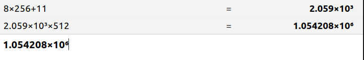

## write

首先是查看 sdb1 的数据区地址

其中 data_start_lba 位于 0xA6B， root_dir_lba 与 数据起始位置相同

由于 0xA6B = 下图所示 2667

下图上半部分是查看文件写入的数据。由于 **file write at lba 0xA6C** A6C= 2668

因此可得在 1366016 处是 file1 的文件内容

当写入两个 helloWorld 后。文件内容如下图上半部分。

由 分区表可知， inode_table 地址位于 0x80B，因此分析如上图。

## delete

且 

block 位图扇区地址为 0x802

inode 位图扇区地址为 0x80A

inode_table 地址位于 0x80B

根目录地址为 0x0x801 与 super地址一样。因为根目录也属于数据区。

### 未删除之前

块位图值为 3，说明分配了 2 个块，分别是 根目录 和 file1 的inode

块位图值为 3，说明分配了 2 个块，一个给了 根目录的 i_sectors[0]， 一个给了 /file1 的  i_sectors[0]

数据区只有 file1，即根目录处。

inode_table处目前只有下图所示 第二个 inode 处数据。具体分析见上面的 write 板块。

### 进行删除

### 删除之后

发现 inode block 都变为 1， 说明 file1 所占的 块 和 inode 都被回收。

inode_table 和 根目录也没有信息了。

值得注意的是， inode_table 中的 file1 是被 inode_delete 删除的， 实际上没有必要， 因为之后会进行覆盖。但是此处为了展示，便写了这个函数。

