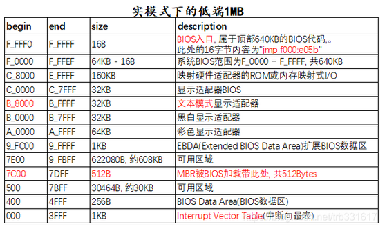
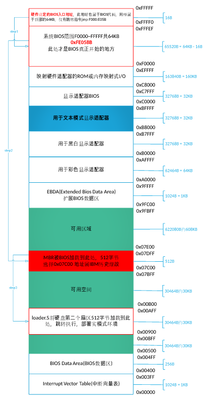
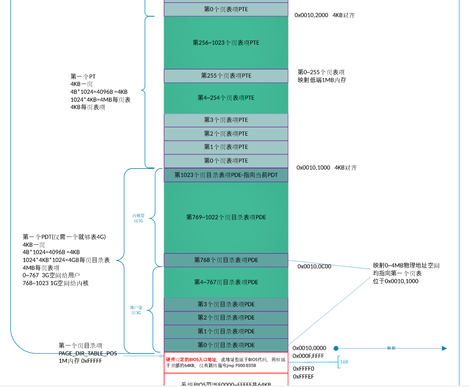
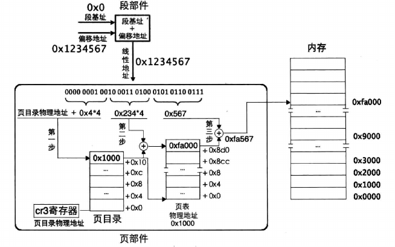
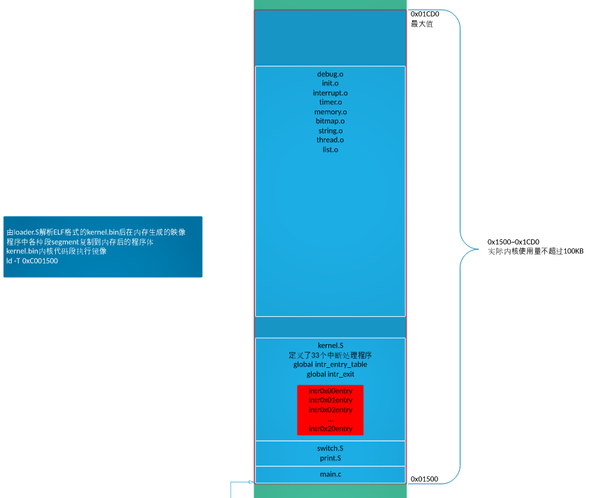
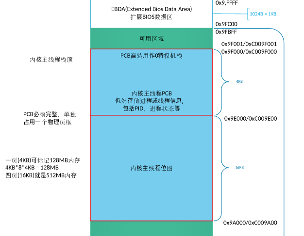
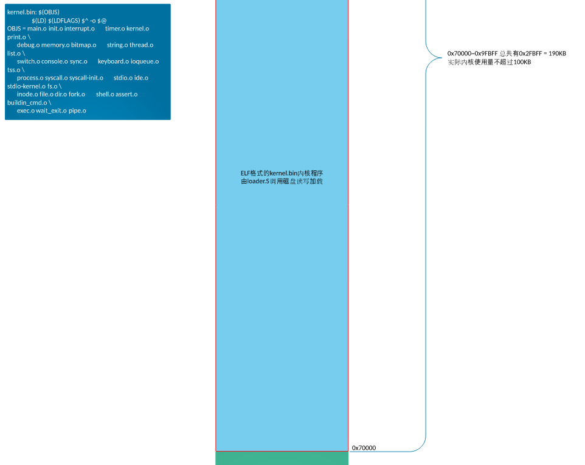
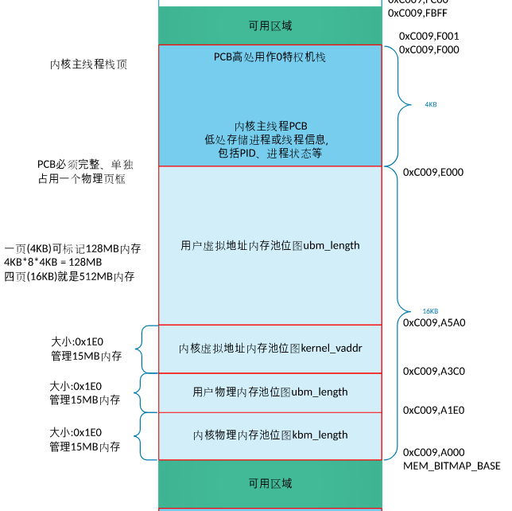
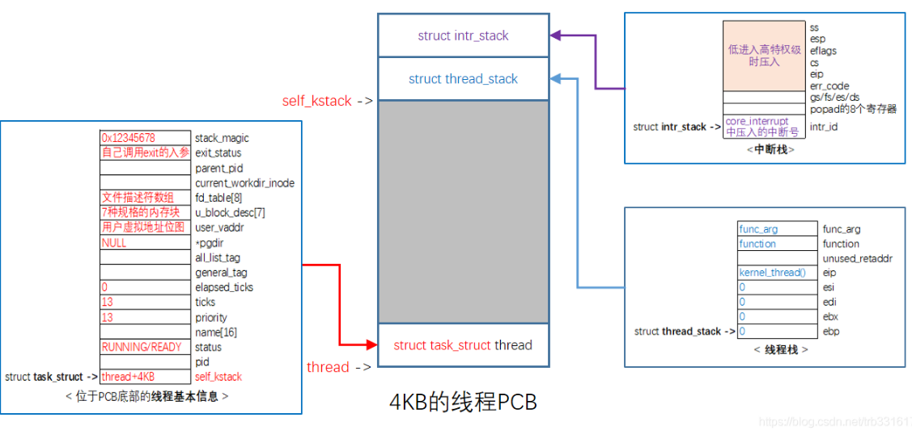

  本项目实现的mini操作系统，包含：

1）内核线程、用户进程、fork和execv、任务调度；

2）中断(时钟, 键盘, 硬盘, 系统调用等)、内存管理、文件系统、shell、管道；

3）基于二元信号量的锁、环形队列。

## 内核体系结构图


## bochs 的：硬盘分布图


魔数
栈边界 20000611
文件系统 20000712

### 空间布局大致介绍

```
   ...
可用空间		<--- 0x9fc00
栈			<--- 0x9f000
   ...
内核文件 kernel.bin	<--- 0x70000
   ...
MBR			<--- 0x7c00
   ...
内核映像 kernel		<--- 0x1500
   ...		
loader.bin(GDT所在处)	<--- 0x900

可用空间		<--- 0x500
BIOS数据区 <---0x400-0x500
中断向量表 <---0~0x3ff
```


--------------------------------

[计算机是如何启动的？](http://www.ruanyifeng.com/blog/2013/02/booting.html)

## 1、实模式

**BIOS->MBR->loader->加载内核**

BIOS ->1.1 硬件自检->1.2 启动顺序(有一个外部储存设备的排序，排在前面的设备就是优先转交控制权的设备)->主引导记录



### 1、BIOS & MBR

首先在开机的一瞬间，CS：IP 强制初始化为 0xF000:0xFFF0,即为BIOS入口地址
BIOS:	0xF0000-0xFFFFF 64KB都为系统 BIOS 范围，被写入ROM中

1. FFFF0-FFFFF BIOS的入口地址， jmp f000:e05b 16B大小中只有这么一条语句，剩下的作为保留

2. 1）检测、初始化硬件，硬件自己提供了一些初始化的功能调用，BIOS直接调用；

   2）在内存0x000 - 0x3FF 建立中断向量表 IVT，这样就可以通过"int 中断号"来实现相关的硬件调用。这些功能的实现也是基于对硬件的IO操作。不过在保护模式下，中断向量表已经不存在了，取而代之的是中断描述符表IDT(Interrupt Descriptor Table)。

   （因为现在还要用键盘和鼠标，这些都要通过中断进行的。——————此时需要也要给客户输出一些结果，因为需要你自己（os)来，所以你还要充当客户对接人。你做了什么工作，做到了什么程度，都要主动显示给客户，也就是在内存空间映射显存的空间，在显示器上显示一些字符。）

3. **检测0盘0道1扇区的内容**（MBR所在处）
   MBR：	位于0盘0道1扇区（由于是 CHS扇区表示方法，即为最开始扇区），末尾为 0x55aa,被识别末尾魔数后，被加载到 0x7c00

   ​		对于 Linux 而言   MBR 相当于由 grub2 第一个要安装的 boot.img

   1. 大小为 512 字节

   2. 7c00：历史原因——尽可能留足够的空间给操作系统在 32K 内加载自己
       ` 0x7FFF - 512 - 512 + 1 ` // 开机扇区512字节，再留出512字节 
       
   3. 引导记录由三个部分组成：

       > 　　（1） 第1-446字节：调用操作系统的机器码。
       >
       > 　　（2） 第447-510字节：分区表（Partition table）。
       >
       > 　　（3） 第511-512字节：主引导记录签名（0x55和0xAA）。


### 2、LOADER

**载入 LOADER 进入实模式环境**

(Linux环境中，目前最流行的启动管理器是[Grub](http://en.wikipedia.org/wiki/GNU_GRUB)。	相当于 Linux 中加载 grub2 的另一个镜像 core.img。)



---------------

在loader.S 加载内核时，主要完成以下任务：

1. 调用 BIOS 中断获取内存大小；

2. 构建 GDT，开启保护模式；

3. 加载 kernel : 将内核文件先放到内存缓冲区  

4. 构建页目录表和页表，开启分页机制；

5. 初始化内核：解析kernel的ELF，将ELF文件中的段segment拷贝到各段自己被编译的虚拟地址处，再跳去执行

   loader.bin 的加载地址为 0x900，放在第 2 块扇区( **boot.inc**) 
   loder.bin 占用 3 个扇区，即使用第 2~4 
   	至于为啥是 0x900，是由于实模式的内存空间布局下0x500 - 0x7BFF 为可用区域，而为啥不是 0x500 ，是完全个人喜好，隔远点

-------------

#### 1）调用BIOS中断获取内存大小

  调用 BIOS 中断 0x15 获取内存大小，并将其值存放在 loader.bin头部（地址0x900），内核将会从该位置读取内存大小（kernel/memory.c mem_init()）。

#### 2）构建 GDT，开启保护模式

2.1 构建GDT。

```assembly
FILE: boot/loader.S
;构建gdt及其内部的描述符
   GDT_BASE:   dd    0x00000000 
	       dd    0x00000000

   CODE_DESC:  dd    0x0000FFFF 
	       dd    DESC_CODE_HIGH4

   DATA_STACK_DESC:  dd    0x0000FFFF
		     dd    DESC_DATA_HIGH4

   VIDEO_DESC: dd    0x80000007	       ; limit=(0xbffff-0xb8000)/4k=0x7
	       dd    DESC_VIDEO_HIGH4  ; 此时dpl为0
```

2.2 加载GDT。lgdt指令，将GDT的基地址、界限值载入至GDTR寄存器。

2.3 打开地址线 A20。

   第 21 条地址线 A20 ：实模式下，处理器访问内存的方式是将段寄存器的内容左移4位，再加上偏移地址，以形成 20 位的物理地址。实模式下，32位处理器的段寄存器的内容仅低 20 位有效，高  20 位全部为0（即，只能使用 20 根地址线）。故，处理器只能访问1MB内存。（回绕）

2.4 禁止中断。

  在设置好保护模式下的中断环境之前，必须关中断(指令cli)。保护模式下的中断机制和实模式不同，原有的中断向量表 IVT 不再适用。而且，保护模式下，BIOS 中断也不能再用，因为它们是实模式下的代码。

2.5 将 CR0 的 PE 位置 1，开启保护模式。

  **控制实模式/保护模式切换的开关是CR0寄存器。**CR0是处理器内部的控制寄存器(Control  Register)，是 32 位的寄存器，包含了一系列用于控制处理器操作模式和运行状态的标志位。 CR0 的第 1 位(位 0 )是保护模式允许位(Protection Enable, PE)，该位置 1 ，则处理器进入保护模式，按保护模式的规则开始运行。

```assembly
   ;-----------------  打开A20  ----------------
   in al,0x92
   or al,0000_0010B
   out 0x92,al

   ;-----------------  加载GDT  ----------------
   lgdt [gdt_ptr]

   ;-----------------  cr0第0位置1  ----------------
   mov eax, cr0
   or eax, 0x00000001
   mov cr0, eax
```


#### 3）加载 kernel :

 将内核文件先放到内存缓冲区  

```assembly
KERNEL_BIN_BASE_ADDR equ 0x70000 ; 自定义kernel被加载到物理内存位置
KERNEL_START_SECTOR  equ 0x09    ; 自定义kernel位于硬盘的扇区号
; -------------------------   加载kernel  ----------------------
   mov eax, KERNEL_START_SECTOR        ; kernel.bin所在的扇区号
   mov ebx, KERNEL_BIN_BASE_ADDR       ; 从磁盘读出后，写入到ebx指定的地址
   mov ecx, 200			       ; 读入的扇区数
   
   call rd_disk_m_32 ;功能:读取硬盘n个扇区
```


#### 4）构建页目录表和页表，开启分页机制；

### 详情见作者的此 Blog

> 地址转换，是由处理器和操作系统共同协作完成的，处理器在硬件上提供地址转换部件，操作系统提供转换过程中所需要的页表。



开启分页机制之前，加载到 cr3 寄存器中的页目录表基地址是物理地址，页表中页表项的地址自然也是物理地址了。虽然内存分页机制的作用是将虚拟地址转换成物理地址，但其转换过程相当于是在关闭分页机制下进行的，过程中所涉及到的地址都被CPU当作物理地址直接送上地址总线，不会被分页机制再次转换(否则会递归转换下去)。



明显 4 K 大小的页表代表 (4K/4)*4K=4M 大小的物理内存

4.1 物理内存1MB之上：

第 1 个4KB, 为页目录表PDT

第 2 个4KB, 为创建的第一个页表（第0和第768(0xc00/4= 768)个页目录项都指向它）

> 这是由于，操作系统的内核位于物理地址的 1MB 以下，但是 OS 的虚拟地址位于 0xc0000000 以上的 1MB 该地址对应的页目录项取决于前 10 位，即 0xc00，为第 768 个目录项。 

第769~1022个页目录项一共指向254个页表（即内核空间）

最后一个页目录项(第1023个)指向页目录表PDT本身

> 为了确保各个用户进程都共享内核，那么需要各个进程第 768~1022 个页目录项均相同，因此在为用户进程创办页表时，应将内核页表中第 768~1022 个页目录项复制到用户进程页目录表相同位置。

因此，共 256 个页，正好 1M 。即，物理内存 1MB 之上的 1MB 已用于页目录表和页表。

4.2 控制寄存器 CR3 指向页目录表基地址

4.3 将 CR0 的 PG 位置1，开启分页机制


### 5）解析kernel的ELF

将ELF文件中的段segment拷贝到各段自己被编译的虚拟地址处

将ELF文件中的段segment拷贝到各段自己被编译的虚拟地址处，将这些段单独提取到内存中，这就是所谓的内存中的程序映像。分析程序中的每个段 segment ，如果段类型不是PT_NULL(空程序类型)，就将该段拷贝到编译的地址中

 这里将kernel的入口定义为 0xc0001500，对应的在编译内核kernel.bin时需要指定该地址。

0x1500（这是由于 loder.bin +2000=0x10d0 凑个整，到0x1500【2000是由于估摸 loder 不会大于 2000 字节】）

```shell
ld -m elf_i386 -Ttext 0xc0001500 -e main -o kernel.bin %.o
```



至于栈选用 0x9f000 是由于首先 0x9fc00 以下为可用区域，但是为了之后放 PCB 取整，因此放在此处。



### 目前所用空间

```
   ...
可用空间		<--- 0x9fc00
栈			<--- 0x9f000
   ...
内核文件 kernel.bin	<--- 0x70000（随便选的
   ...
MBR			<--- 0x7c00
   ...
内核映像 kernel		<--- 0x1500（这是由于 loder.bin +2000=0x10d0 凑个整，到0x1500（2000是由于估摸 loder 不会大于 2000 字节））
   ...		
loader.bin(GDT所在处)	<--- 0x900

可用空间		<--- 0x500
BIOS数据区 <---0x400-0x500
中断向量表 <---0~0x3ff
```



### 6）跳转

```shell
; FILE: boot/loader.asm
; 截取部分代码
 
KERNEL_ENTRY_POINT equ 0xc0001500
 
mov esp, 0xc009f000     ; 自定义内核主线程PCB中的栈顶
jmp KERNEL_ENTRY_POINT
```

至此，进入 kernel 即 main。


## 附：Linux 初始化过程

[Linux 的启动流程](http://www.ruanyifeng.com/blog/2013/08/linux_boot_process.html)

我们知道系统是从BIOS加电自检，载入MBR中的引导程序(LILO/GRUB),再载入linux内核開始执行的，一直到指定shell開始执行告一段落，这时用户開始操作Linux。

首先介绍 Linux 的初始化


start_kernel  -->rest_init --> init --> kthreadd --> cpu_idle_loop 

在操作系统里面，先要有个创始进程，有一行指令 set_task_stack_end_magic(&init_task)。这里面有一个参数 init_task，它的定义是 struct task_struct init_task =  INIT_TASK(init_task)。它是系统创建的第一个进程，我们称为**0 号进程**。这是唯一一个没有通过 fork 或者 kernel_thread 产生的进程，是进程列表的第一个。即 **idle 进程**。

​	该进程是内核的一部分，所有进程的根进程，它并不执行任何磁盘上的程序，因此也被称为系统进程。

**说明一下 rest_init（）**

1. **init **

   在 rest_init 的第一大工作是，用 kernel_thread(kernel_init, NULL, CLONE_FS) 创建第二个进程，这个是**1 号进程**。1 号进程的目的是为了作为用户态的总管。系统中所有其它用户进程的祖先进程。**init 进程决不会终止**。它是一个普通的用户进程（与交换进程不同，它不是内核中的系统进程），但是它**以超级用户特权运行**。

   当前执行 kernel_thread 这个函数的时候，我们还在内核态，现在我们就来跨越这道屏障，到用户态去运行一个程序。1 号进程 调用  do_execve  ，访问内核中保存用户态运行上下文的寄存器们，将用户态的代码段 CS 设置为 USER_CS，将用户态的数据段 DS 设置为 USER_DS，以及指令指针寄存器 IP、栈指针寄存器 SP。再通过 iret 返回 pop 出更改的寄存器， 进入用户态。以进行各种系统的初始化。启动系统的服务，启动控制台，用户就可以登录进来了。

   1号进程从0号进程fork出来，然后又切换到用户态，完成控制权从核心态到用户态的转换， 
    因此**用户交互才能开始**。

   至于 init 为何是 systemd  [Systemd 入门教程：命令篇](http://www.ruanyifeng.com/blog/2016/03/systemd-tutorial-commands.html)见此博客

   systemctl

   

2. **kthreadd** 页守护进程

   rest_init 第二大事情就是第三个进程，就是 2 号进程。这里的函数 kthreadd，负责所有内核态的线程的调度和管理，是内核态所有线程运行的祖先。负责虚拟内存系统的分页操作。

   通过 以下命令进行查看，发现 PID 为 1 是 /sbin/init,  2 为 kthreadd

   ```
   ps -ef
   ```

   其中用户态的不带中括号，内核态的带中括号。
   
   
   
   进程号依次增大，但是你会看所有带中括号的内核态的进程，祖先都是 2 号进程。而用户态的进程，祖先都是 1 号进程。tty 那一列，是问号的，说明不是前台启动的，一般都是后台的服务。
   
   >  ps -ef 这个命令的父进程是 bash。这样整个链条都比较清晰了。
   >
   > `husharp  26859  8355  0 14:10 pts/1    00:00:00 ps -ef`
   >
   > `husharp   8355  6773  0 10:42 pts/1    00:00:00 bash`
   >
   > `husharp   6773  2294  0 10:17 ?        00:00:01 /usr/lib/gnome-terminal/gnome-te`
   >
   > `husharp   2294     1  0 09:45 ?        00:00:00 /lib/systemd/systemd --user`
   >
   > 从下向上进行索引，发现最后父节点是 init，说明是用户态
   
   

因此， idle 实则就是 while ，当没有线程调度时，便运行 idle，在 init 开始后才运行，因此 init 的 pid 为 1 ， 而 idle 并非为 1.


某 ucore 群友做的图


**Linux 相关补充阅读**

[Linux内核的idle进程分析](https://www.cnblogs.com/cynchanpin/p/7323299.html)

[动静结合学内核：linux idle进程和init进程浅析](https://blog.csdn.net/titer1/article/details/44464647)

[Linux中main是如何执行的](https://www.cnblogs.com/harlanc/p/7774882.html)

## 2、HuSharp_OS     内核线程/用户进程

而对于 HuSharp_OS 而言，首先通过 init_all 进行各个初始化 (init.c)

```c
void init_all() {
    put_str("init_all start!\n");
    idt_init();// 初始化中断
    
    mem_init();//初始化内存管理系统
    thread_environment_init();// 初始化线程相关环境
    timer_init();   // 初始化 PIT
    console_init(); // 初始化 console 
    keyboard_init();
    tss_init();
    syscall_init();   // 初始化系统调用
    intr_enable();      // 后面的 ide_init 需要打开中断
    ide_init();     //初始化硬盘
    filesys_init(); // 初始化文件系统
}
```

在 thread_environment_init  (thread.c）中进行相关进程的初始化   

```c
void thread_environment_init(void) {
    put_str("thread_init start!\n");
    list_init(&thread_ready_list);
    list_init(&thread_all_list);
    lock_init(&pid_lock);

    // 创建第一个用户进程 init
    // 放在第一个初始化， pid 为 1
    process_execute(init, "init");

    // 将 main 函数创建为 线程
    make_main_thread();
    // 创建 idle 线程
    idle_thread = thread_start("idle", 10, idle, NULL);
    put_str("thread_init done!\n");
}
```

### init 进程

init 是用户级进程，是第一个启动的程序，其 pid 为1。init 是所有进程的父进程。为了抢夺 pid 1，因此我们在 创建主线程的函数 make_main_thread 之前，进行 init 的创建。

init fork 出 shell 程序，以方便用户交互

```c
// init 进程
void init(void)
{
    unsigned int ret_pid = fork();
    if(ret_pid)     // 父进程
    {
        int status, child_pid;
        while(1) // init在此处不停地回收过继给它的子进程
        {
            child_pid = wait(&status);
            printf("i am init, my pid is %d, i recieve a child, it's pid is %d, status is %d\n", child_pid, status);
        }
    }
    else        // 子进程
    {
        my_shell();
    }
    panic("ERROR: during init, should not be here");
}
```

### main 线程



由于在开机到创建第一个线程前，程序都是有个执行流的，这个执行流从 BIOS 到 mbr 到 loader 到 kernel，他是主线程 main   。因为 main 线程早已运行,咱们在loader.S中进入内核时的mov esp,0xc009f000，就是为其预留了tcb，地址为 0xc009e000。

```c
int main(void)
{
    init_all();     // kernel/init.c 初始化所有模块
 
    cls_screen();
    console_put_str("[husharp@HuSharp_OS /]$ ");
 
    // 主线程完成使命后退出
    thread_exit(running_thread(), true);
    return 0;
}
```

 内核的 main_thread 完成系统的初始化工作，然后 thread_exit。

### idle 进程

为何会有 idle 进程（**0 号进程**）？

当就绪队列中没有任务时，调度器没有任务可调时，会报错 thread_ready_list is empty!

```
   // 实现就绪队列为空时，唤醒 idle
   if (list_empty(&thread_ready_list)) {
        thread_unblock(idle_thread);
    }
```

idle 线程用于系统空闲时，运行（idle ：翻译：懈怠的；懒惰的；闲置的；没有工作的。）

```c
    内核线程/用户进程
    |---- FILE: thread/thread.c     thread_init()
    |       | 初始化线程环境
    |       | list_init()     初始化就绪/全部队列
    |       | pid_pool_init() 初始化pid池, 指定起始pid为1 (基于bitmap和lock)
    |       |
    |       | process_execute(init, "init") 创建第一个用户进程init, 其pid为1
    |       | make_main_thread() 将当前内核main函数创建为线程
    |       | idle_thread = thread_start("idle", 10, idle, NULL) 创建idle线程 
    |       |
    |       | 至此, 参与调度的有: init进程、main线程、idle线程
    |       |
    |       |---- FILE: user/process.c      process_execute()
    |       |       | 创建用户进程
    |       |       | struct task_struct *thread = get_kernel_pages(1) 申请1页内核内存作为用户进程PCB
    |       |       | init_thread() 在PCB中初始化线程基本信息
    |       |       |     申请pid allocate_pid()
    |       |       |         {bitmap_scan(); bitmap_set(); return (index + pid_pool.pid_start);}
    |       |       |     进程名、状态READY、内核态时的栈顶(PCB顶部)、优先级、嘀嗒时间数
    |       |       |     初始化文件描述符数组pthread->fd_table[8], 标准输入/输出/错误012, 其余为-1 
    |       |       |     根目录作为默认工作路径 pthread->current_work_dir_inode_id = 0
    |       |       |     父进程pid初始为-1
    |       |       |     页目录表pgdir初始为NULL, 在紧接着的create_page_dir()创建页目表时赋值
    |       |       | create_user_vaddr_bitmap() 创建用户虚拟内存空间的bitmap
    |       |       |     指定用户进程虚拟地址起始值; 申请1页内核内存
    |       |       | 
    |       |       | thread_create(thread, start_process, filename)
    |       |       |     初始化PCB中的thread_stack。当处理器进入kernel_thread函数体时,
    |       |       |         栈顶为返回地址、栈顶+4为参数function、栈顶+8为参数func_arg
    |       |       |         kthread_stack->eip = kernel_thread      函数kernel_thread
    |       |       |         kthread_stack->function = start_process 函数start_process
    |       |       |         kthread_stack->func_arg = filename      待创建的进程
    |       |       |      
    |       |       | thread->pgdir = create_page_dir()     创建页目录表
    |       |       |     在内核空间申请一页内存作为用户进程的页目录表  get_kernel_pages(1)
    |       |       |     从内核页目录表中拷贝内核空间的页目录项到用户进程的页目录中  memcpy()
    |       |       |     页目录表物理基地址写入页目录表最后一项
    |       |       |
    |       |       | block_desc_init(thread->u_block_desc) 初始化内存规格信息, 为malloc/free做准备
    |       |       | list_append() 添加到就绪队列和全部队列
    |       |       
    |       |---- FILE: thread/thread.c     make_main_thread()
    |       |       | 将 kernel 中 main 函数完善为主线程
    |       |       | main 线程早已运行, 在LOADER阶段已预留并指定了PCB "mov esp, 0xc009_f000"
    |       |       | 即, PCB基址为0xc009_e000
    |       |       |     main_thread = running_thread();
    |       |       |     init_thread(main_thread, "main", 31);
    |       |       |     list_append() 添加到全部队列
    |       |       
    |       |---- FILE: thread/thread.c     thread_start()
    |       |       | 创建内核线程
    |       |       | struct task_struct *thread = get_kernel_pages(1) 申请1页内核内存作为内核线程PCB
    |       |       | init_thread() 在PCB中初始化线程基本信息
    |       |       |     初始化PCB底部的线程信息struct task_struct
    |       |       |     申请pid allocate_pid()    
    |       |       | thread_create(thread, function, func_arg)
    |       |       |     初始化PCB中的thread_stack
    |       |       |     不同于创建进程时的参数function为start_process, 这里直接为所要创建的线程, 
    |       |       |       即switch_to()任务切换后, 将直接执行对应的线程函数
    |       |       |       kthread_stack->eip = kernel_thread      函数kernel_thread
    |       |       |       kthread_stack->function = function      线程对应的函数
    |       |       |       kthread_stack->func_arg = func_arg      线程参数
    |       |       |
    |       |       | list_append() 添加到就绪队列和全部队列
    |
    |---- FILE: thread/thread.c     idle()
    |       | 系统空闲时运行的线程(block/unblock)
    |       | while(1){thread_block(TASK_BLOCKED); asm volatile("sti; hlt" : : : "memory");}    
    |       | idle线程在创建时会被加入到就绪队列, 因此会执行一次, 然后阻塞;
    |       | 当就绪队列为空时, schedule会将idle解除阻塞, 也就是唤醒
    |       |
    |       |---- thread_block()
    |       |       | 当前线程将自己阻塞
    |       |       | 修改线程状态为阻塞、触发调度, 切换线程执行
    |       |       | schedule() 由当前阻塞线程主动触发的任务调度
    |       |       | 由于idle线程触发调度后没有被加入就绪队列, 所以将得不到执行, 除非被唤醒
    |       |
    |       |---- thread_unblock()
    |       |       | 将指定的线程解阻塞
    |       |       | 添加到就绪队列头部, 修改状态为READY
    |       |       | list_push(&thread_ready_list, &pthread->general_tag)
    |       |       | pthread->status = TASK_READY
    |
    |---- FILE: kernel/main.c   main()
    |       | 内核主线程
    |       | init_all()
    |       | thread_exit(running_thread(), true);
    |       | 主线程完成使命后退出 return 0;
    |
    |---- FILE: kernel/main.c   init()
    |       | init进程
    |       | 第一个用户进程, pid为1
    |       | init是所有进程的父进程, 它还要负责回收过继给它的子进程
    |       | if(fork())    // 父进程
    |       | { while(1){wait(&status);} }
    |       | else          // 子进程
    |       | { my_shell(); }
```


## 3、中断和系统调用

详情见 此Blog 

  本项目支持的中断有：时钟、键盘、硬盘、int 0x80（系统调用）。


## 4、内存管理

详情见此 Blog

这里先从指定位置处读取LOADER写入的物理内存大小。本项目中，物理内存的配置为32M(bochs配置文件bochsrc.cfg中"megs:  32")，减去低端的1MB、减去LOADER开启分页机制时创建PDT和PT占用的1MB（紧邻低端1MB之上），还有30MB，内核和用户内存池各占15M。所以，内核物理内存池的起始地址为 0x20_0000（2MB）。

以页(4KB)为单位的内存管理，采用bitmap(位图)技术。本项目中，自定义内核物理内存的bitmap存放于0xc009_a000，自定义内核主线程栈顶为0xc009_f000、内核主线程PCB为0xc009_a000。所以，本系统最大支持4个页框的位图（一个页框大小的位图可表示128M内存，4个页框即512M），用于内核/用户物理内存池bitmap、内核虚拟地址池bitmap。

实现方法类似 Linux 中的伙伴系统， 在以页(4KB)为单位的内存管理基础上，实现小内存块的管理，可满足任意内存大小的分配与释放(malloc/free)。这里采用arena模型。


## 5、任务调度




1) 基于时钟中断的任务调度, 时钟的中断处理程序 intr_timer_handler()
   处理器进入0特权级时, 会自动在任务状态段TSS中获得0特权级的栈地址, 即current线程PCB顶部的struct intr_stack
   中断的入口intr_%1_entry会执行一系列压栈操作(FILE: kernel/core_interrupt.asm), 
   (若是从低特权级进入高特权级, 还会自动压栈: ss esp eflags cs eip err)
2) (此时是current的PCB) 函数schedule()中, 若next为进程则修改TSS的esp0(next被中断时使用, 这里还是current的), 然后
    调用 switch_to(current_thread, next), 将自动在PCB顶部继续压栈(可参考struct thread_stack): 
        next current_thread eip/retaddr(这里的eip指向的是函数schedule()中switch_to的下一条指令代码)
3) switch_to()

   1. (此时是current的PCB) 继续压栈: esi edi ebx ebp
   2. (为current保存esp到PCB底部) 从[esp+5*4]处得到栈中参数current_thread(即PCB底部), 再mov [eax], esp
   3. (切换esp为next的esp) 从[esp+6*4]处得到栈中参数next(即PCB底部, PCB底部保存的是esp值), 再mov esp, [eax]
   4. (此时是next的PCB) 出栈: ebp ebx edi esi
   5. (利用ret自动从栈中弹出给eip的特性实现执行流的切换) ret
       若该任务是第一次执行, 则此时eip为kernel_thread()函数(这是在thread_create()函数中初始化的)
                             执行kernel_thread()时会将栈中的2个值当作其参数function和arg, 执行function(arg);
                             (栈中的function和arg也是在thread_create()中初始化的)若为线程, function为直接线程函数;
                             若为进程, function为start_process(), arg为进程程序
       若该任务并非第一次执行, 则此时eip指向的是函数schedule()中switch_to的下一条指令代码(类似于这里的current)
            而swith_to是schedule最后一句代码, 因此执行流程马上回到schedule的调用者intr_timer_handler中
            schedule也是intr_timer_handler中最后一句代码, 因此会回到core_interrupt.asm中的jmp intr_exit, 
            从而恢复任务的全部寄存器映像, 之后通过iretd指令退出中断, 任务被完全彻底恢复


## 6、文件系统


## 7、Shell

CRT相关

fork 、execv、wait、load、cmd_execute

详情见此 Blog

## 8、锁

二元信号量的锁

```c
锁
| struct lock pid_lock;        // 申请pid  FILE: thread/thread.c    
| struct lock console_lock;    // 控制台锁 FILE: device/console.c   console_init()
|
|---- FILE: thread/sync.c   lock_init(&console_lock)
|       | 初始化锁
|       | 基于二元信号量实现的锁
|       | struct semaphore{
|       |     unsigned char value; struct list waiters; };
|       |     信号量初值, 此信号量上阻塞的所有线程    
|       | struct lock{
|       |     struct task_struct *holder; struct semaphore sema; unsigned int holder_repeat_num; };
|       |     锁的持有者, 信号量, 锁的持有者重复申请锁的次数    
|       
|---- FILE: thread/sync.c   lock_acquire()
|       | 获取锁
|       | sema_down(&lock->semaphore)信号量P操作
|       |     while(sema->value == 0)   // value为0表明已经被别人持有
|       |         list_append()当前线程把自己加入该锁的等待队列
|       |         thread_block()当前线程阻塞自己，并触发调度，切换线程
|       |         ************************************* 调度 *********
|       | lock->holder = running_thread()
|       |
|       |---- FILE: thread/thread.c     thread_block()
|               | 当前线程将自己阻塞
|               | 修改线程状态为阻塞、触发调度, 切换线程执行
|               |
|               |---- FILE: thread/thread.c     schedule()
|                       | 任务调度 (由当前阻塞线程主动触发)    
|
|---- FILE: thread/sync.c   lock_release()
        | 释放锁
        | lock->holder = NULL
        | sema_up(&lock->semaphore)信号量V操作
        |     list_pop(&sema->waiters)从等待队列中取出一个线程
        |     thread_unblock()唤醒该阻塞线程: 将阻塞线程加入就绪队列，并修改状态为READY
        |     sema->value++    
        |
        |---- FILE: thread/thread.c     thread_unblock()
                | 唤醒阻塞线程
                | 将阻塞线程加入就绪队列，并修改状态为READY
```


## 9、环形队列

生产者消费者模型

```c
环形队列
| struct ioqueue keyboard_buf;  // 键盘
| struct ioqueue * xxx = xxx;   // 管道
|
|---- FILE: device/ioqueue.c    ioqueue_init(&keyboard_buf)
|       | 初始化环形队列
|       | 结合锁机制、生产者消费者模型
|       | struct ioqueue{
|       |     struct lock lock; // 锁
|       |     struct task_struct *producer, *consumer; // 睡眠的生产者/消费者
|       |     char buf[buffersize]; // 缓冲区
|       |     signed int head, tail; }; // 队首写入, 队尾读出
|
|---- FILE: device/ioqueue.c    ioq_getchar()
|       | 消费者消费一个字符
|       | while(ioq_empty(ioq)) // 缓冲区为空时, 消费者睡眠
|       |     lock_acquire(&ioq->lock);    // 获取锁, 每个锁对应的信号量都会有一个阻塞队列
|       |     ioq_wait(&ioq->consumer);    // 消费者睡眠
|       |     lock_release(&ioq->lock);    // 释放锁
|       | char byte = ioq->buf[ioq->tail]; // 消费一个字符
|       | if(ioq->producer !=NULL) wakeup(&ioq->producer); // 唤醒生产者(生产者睡眠是因为缓冲区满)    
|       
|---- FILE: device/ioqueue.c    ioq_putchar()
|       | 生产者生产一个字符
|       | while(ioq_full(ioq)) // 缓冲区满时, 生产者睡眠
|       |     lock_acquire(&ioq->lock); // 获取锁, 每个锁对应的信号量都会有一个阻塞队列
|       |     ioq_wait(&ioq->producer); // 生产者睡眠
|       |     lock_release(&ioq->lock); // 释放锁
|       | ioq->buf[ioq->head] = byte;   // 生产一个字符
|       | if(ioq->consumer !=NULL) wakeup(&ioq->consumer); // 唤醒消费者(消费者睡眠是因为缓冲区空)
```


--------------------------

全局描述符表：保护模式下内存段的登记表 即位于 Loader 0x900处
描述符desc 占 8 个字节，含有 base，limit，addr等
选择子：位于段寄存器，是 GDT 的索引
--------选择子结构---------
15		3  2   0

描述符索引值	 TI  RPL
--------------------------
--------------------- 中断 --------------------------
中断过程：一个中断源会产生一个中断向量，一个向量对应中断描述符表中的一个门描述符，通过该描述符找到对应的中断处理程序。（中断发生时，eflags 的 NT & TF 位被置为 0 ；中断返回为 iret）
中断向量表 （IVT）：由于 IVT 是在实模式下存储中断处理程序入口的表。因此在实模式中固定在 0~0x3ff(1024个字节)
中断向量：4 字节，因此 IVT 中有 256 个中断向量
中断描述符：8 字节
中断描述符表：位置不固定，由 IDTR 存储位置。 
中断发生时的压栈：先判断 特权级，（若特权级发生变化，需要保存 旧ss 和 esp 值），再压入 eflags, cs, eip, error_code。 


kernel 选择第 9 扇区（从 1 扇区开始算则为第 10 个扇区————纯粹个人喜好，与 loader 隔远点）
且 由于以后内核大小不会超过 100 kb，因此将大小设为 200 扇区（图方便）
kernel.bin 放到 0x70000 因为 0x70000~0x9fbff 为空闲位置，有 190KB > kernel.bin

内核：内核被加载到内存中，loader 还需要通过分析 elf 结构来将 kernel.bin 展开到新的位置。因此：内核在内存中有两份：
	1.为 elf 格式的 kernel.bin 文件，经过解析之后就没用了
	2.为 loader 解析 1.文件后，在内存中生成的 kernel 映像，即完成初始化内核后的的真正运行内核。
	注：初始化内核，就是根据 elf 规范，将内核文件中的段（segment）复制到内存中的相应位置
内核的入口虚拟地址为：0xc0001500
	来源是：为了内核映像不覆盖 loader.bin(因为里面有 GDT)，由于 loader.bin 加载地址为 0x900，大小 < 2000字节，因此 0x900+2000 = 0x10d0，因此选个整数为 0x1500
栈起始地址改为：0xc009f000
	--->至于为何不是 0xc009fc00 是由于 PCB 占一页 1000，因此为了对齐，需要采用整数

---------------------------------所以空间布局-----------------------------
   ...
可用空间		<--- 0x9fc00
栈			<--- 0x9f000
   ...
内核文件 kernel.bin	<--- 0x70000
   ...
MBR			<--- 0x7c00
   ...
内核映像 kernel		<--- 0x1500
   ...		
loader.bin(GDT所在处)	<--- 0x900

可用空间		<--- 0x500

而 total_mem_bytes 与loader.bin 之间还有 4 个段描述符（第 0 个不可用，第 1 个为代码段，第 2 个为数据段和栈，第 3 个为显存段）
以及 60 个预留段描述符槽位，因此 (60 + 4) * 8 = 512 = 0x200
total_mem_bytes : 0xb00 (存储获取到的内存变量)

页目录表： （物理地址）0x100000~0x100fff 4KB
第一个页表：（物理地址）0x101000~0x101fff 4KB
为映射到 0xc0000000，对应的页目录项为第 768 个，由于一个页表(页表项4字节)表示 4MB = (4GB/4KB)*4字节
所以第 768 个页目录项对应的虚拟地址 4MB：0xc0000000~0xc003ffff 指向低端 4MB之内的物理地址
为了实现所有用户共享内核，因此将 各个用户的虚拟地址高 1 GB都指向内核所在的物理内存空间。即每个用户 768~1022（共254个PDE）都与其他进程一致。（即：提前将内核的所有PDE都定下来，在创建用户进程时，直接将内核对应PDE复制，以达到内核共享）。


虚拟地址 0xc0000000~0xc00fffff 映射 物理地址 0x00000000~0x000fffff(低端 1Mb 内存)
0xc0100000：堆的起始地址（注意：由于0x100000~0x101fff为页目录表和页表，因此 0xc0100000并不映射到此处，需要绕开）
0xc009f000是内核主线程栈顶，
0xc009e000是内核主线程的pcb. PCB占用 1 页 0x1000
0xc009a000:位图位置

0xc0000000是内核从虚拟地址3G起. 0x100000意指跨过低端1M内存

0x9f000：内核主线程栈顶
内核估计 70 kb 左右。装载到 0x9f000绰绰有余
因此在 低端 1MB 下所用到的最高地址，即为 main线程的栈顶地址 0x9f000

0xc009a000:位图位置
一个页框大小的位图可表示128M内存, 位图位置安排在地址0xc009a000

由于 虚拟机配置 32 MB 物理内存，因此需要 1024 字节 bitmap -> 4kb * 1024 * 8 = 32 MB
即  1/4 页 ，但是我很任性，想搞 4 页，即 0x4000
又因为 pcb 位于 0xc009e000，所以将位图放在下面 0xc009e000 - 0x4000 = 0xc009a000

堆的起始地址：（为了让虚拟地址连续）
#define K_HEAP_START 0xc0100000 


--------------------------------------------------
PCB ----> task_struct
struct task_struct {
   uint32_t* self_kstack;	 // 各内核线程都用自己的内核栈,用来记录栈顶指针
   _pid_t pid;
   enum task_status status;
   char name[16];
   uint8_t priority;
   uint8_t ticks;	   // 每次在处理器上执行的时间嘀嗒数
   uint32_t elapsed_ticks;// 此任务自上cpu运行后至今占用了多少cpu嘀嗒数,也就是此任务执行了多久
   struct list_elem general_tag;//general_tag的作用是用于线程在一般的队列中的结点				    
   struct list_elem all_list_tag;// all_list_tag的作用是用于线程队列thread_all_list中的结点 
   uint32_t* pgdir;              // 进程自己页表的虚拟地址
   struct virtual_addr userprog_vaddr;   // 用户进程的虚拟地址
   uint32_t stack_magic;	 // 用这串数字做栈的边界标记,用于检测栈的溢出
};

寄存器映像	---中断栈 intr_stack： 	| kernel.S 中的 intr_exit 的出栈操作为此结构的逆操作
	1.任务被中断时，保存寄存器映像
	2.给进程预留，用来填充用户进程上下文，即寄存器环境		
栈		---线程栈 thread_stack：保存待运行的函数，并进行任务切换	| 内核栈 = 中断栈 + 线程栈
栈指针		---记录线程栈栈顶，因为中断栈不固定 <----self_kstack
pid
进程状态
优先级
时间片
页表
打开文件描述符
父进程
...


----------------------------------------------------
switch_to

---------------------------------------------------
系统调用步骤：
1. 在 syscall.h 的结构 enum SYSCALL_NR 中添加新的子功能号
2. 在 syscall.c 中增加系统调用的用户接口
3. 在 syscall_init.c 定义子功能处理函数，并在syscall_table 中注册


---------------------------------------------------------
端口就是位于 IO 控制器上的接口

command 寄存器要最后写入，因此一旦写入，硬盘便开始工作
我们自己规定对硬盘的操作步骤：
1、先选择


## 实现的系统调用

   syscall_table[SYS_GETPID] = sys_getpid;

   syscall_table[SYS_WRITE] = sys_write;

   syscall_table[SYS_MALLOC] = sys_malloc;

   syscall_table[SYS_FREE] = sys_free;

   syscall_table[SYS_FORK] = sys_fork;

   syscall_table[SYS_READ] = sys_read;

   syscall_table[SYS_PUTCHAR] = sys_putchar;

   syscall_table[SYS_CLEAR]   = cls_screen;*// 位于 print.S*

   syscall_table[SYS_GETCWD]     = sys_getcwd;

   syscall_table[SYS_OPEN]       = sys_open;

   syscall_table[SYS_CLOSE]      = sys_close;

   syscall_table[SYS_LSEEK]    = sys_lseek;

   syscall_table[SYS_UNLINK]   = sys_unlink;

   syscall_table[SYS_MKDIR]    = sys_mkdir;

   syscall_table[SYS_OPENDIR]  = sys_opendir;

   syscall_table[SYS_CLOSEDIR]   = sys_closedir;

   syscall_table[SYS_CHDIR]    = sys_chdir;

   syscall_table[SYS_RMDIR]    = sys_rmdir;

   syscall_table[SYS_READDIR]  = sys_readdir;

   syscall_table[SYS_REWINDDIR]   = sys_rewinddir;

   syscall_table[SYS_STAT]  = sys_stat;

   syscall_table[SYS_PS]    = sys_ps;

   syscall_table[SYS_EXECV]    = sys_execv;


## 实现函数

uint32_t getpid(void);

uint32_t write(int32_t fd, const void* buf, uint32_t count);

void* malloc(uint32_t size);

void free(void* ptr);

int16_t fork(void);

int32_t read(int32_t fd, void* buf, uint32_t count);

void putchar(char char_asci);

void clear(void);

char* getcwd(char* buf, uint32_t size);

int32_t open(char* pathname, uint8_t flag);

int32_t close(int32_t fd);

int32_t lseek(int32_t fd, int32_t offset, uint8_t whence);

int32_t unlink(const char* pathname);

int32_t mkdir(const char* pathname);

struct dir* opendir(const char* name);

int32_t closedir(struct dir* dir);

int32_t rmdir(const char* pathname);

struct dir_entry* readdir(struct dir* dir);

void rewinddir(struct dir* dir);

int32_t stat(const char* path, struct file_attr* buf);

int32_t chdir(const char* path);

void ps(void);

int execv(const char* pathname, char** argv);

