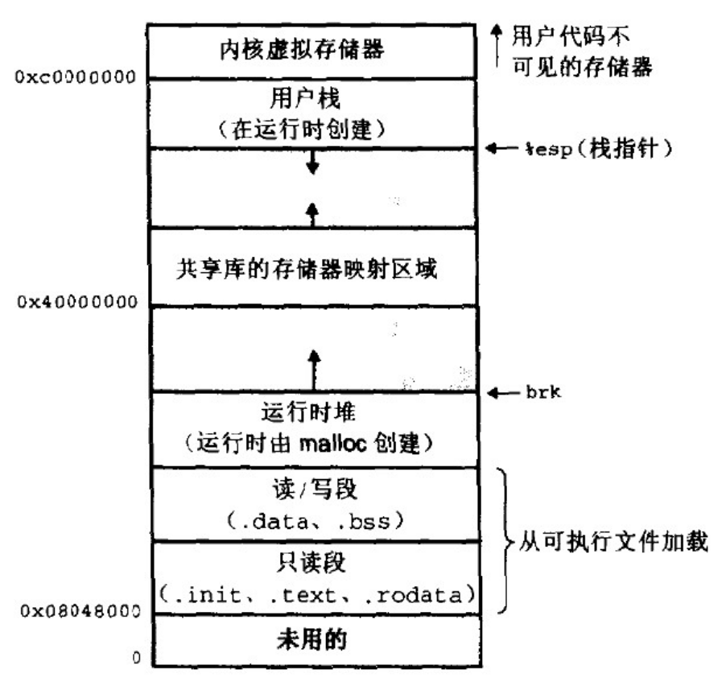
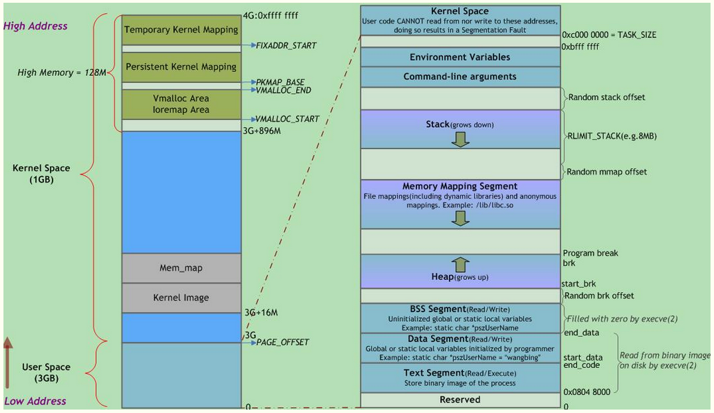
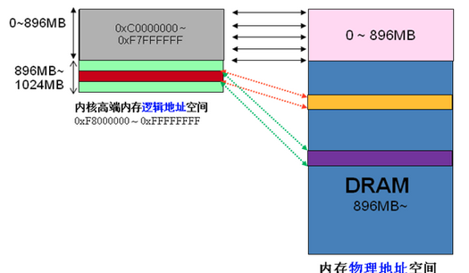
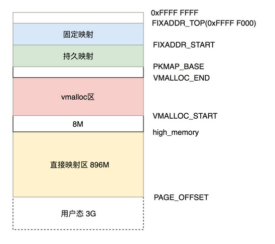
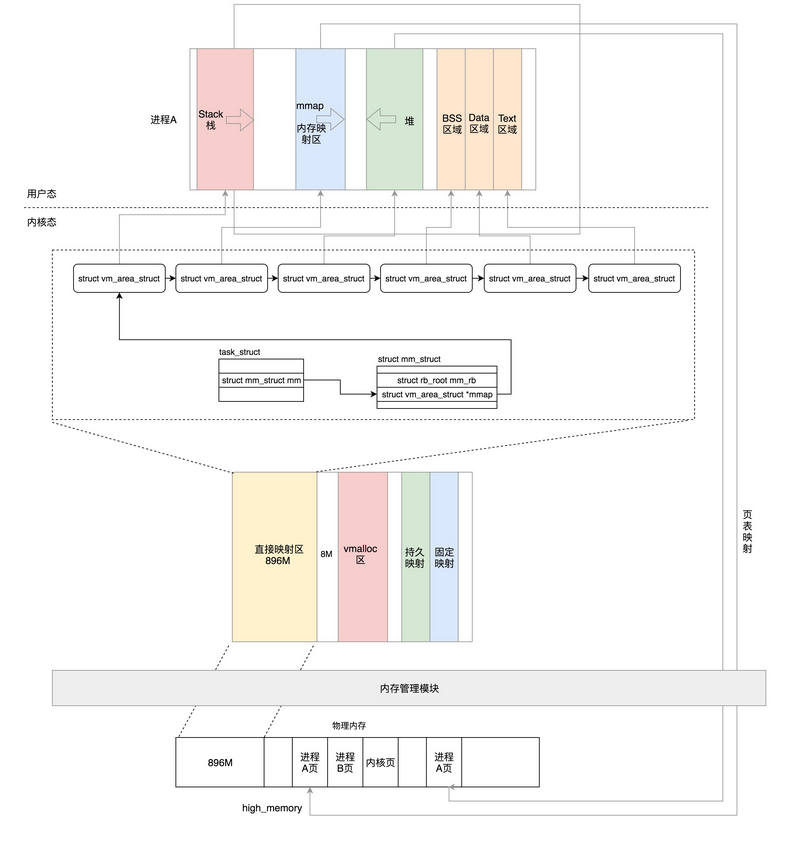
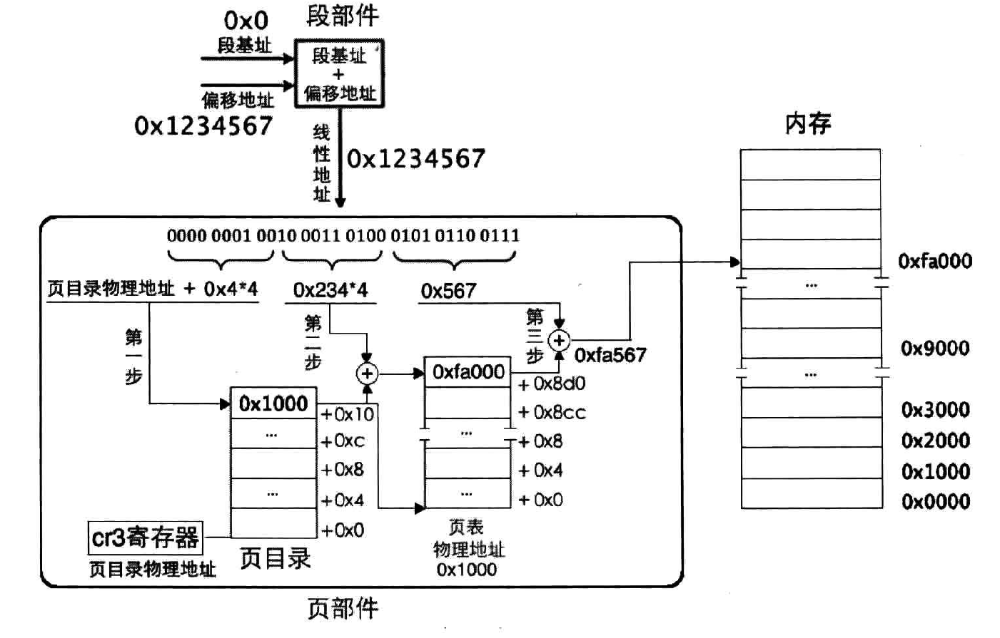
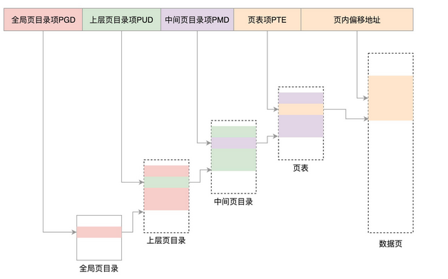

# 内存管理

操作系统的内存管理，主要分为三个方面。

第一，物理内存的管理，相当于会议室管理员管理会议室。

第二，虚拟地址的管理，也即在项目组的视角，会议室的虚拟地址应该如何组织。

第三，虚拟地址和物理地址如何映射，也即会议室管理员如果管理映射表。

## 前置知识

### 首先：内存访问为什么要分段？

程序分段首先是为了重定位

程序分段又是为了将大内存分成可以访问的小段，通过这样变通的方法便能够访问到所有内存了。


### 其次：程序中的分段（data、text）与内存访问中的分段

程序代码中的段（用section或segment来定义的段，不同汇编编译器提供的关键字有所区别，功能是一样的）和内存访问机制中的段本质上是一回事。在硬件的内存访问机制中，处理器要用硬件——段寄存器，指向软件——程序代码中用section或segment以软件形式所定义的内存段。

**程序为何要分段？**

为了让程序内指令接连不断地执行，要把指令全部排在一起，形成一片连续的指令区域，这就是代码段。这样 CPU 肯定能接连不断地执行下去。指令是由操作码和操作数组成的，这对于数据也一样，程序运行不仅要有操作码，也得有操作数，操作数就是指程序中的数据。把数据连续地并排在一起存储形成的段落，就称为数据段。

> **将数据和代码分开的好处有三点。**
>
> 第一，可以为它们赋予不同的属性。
>
> 例如数据本身是需要修改的，所以数据就需要有可写的属性，不让数据段可写，那程序根本就无法执行啦。程序中的代码是不能被更改的，这样就要求代码段具备只读的属性。真要是在运行过程中程序的下一条指令被修改了，谁知道会产生什么样的灾难。
>
> 第二，为了提高CPU内部缓存的命中率。
>
> 大伙儿知道，缓存起作用的原因是程序的局部性原理。在CPU内部也有缓存机制，将程序中的指令和数据分离，这有利于增强程序的局部性。CPU内部有针对数据和针对指令的两种缓存机制，因此，将数据和代码分开存储将使程序运行得更快。代码指令根据流程依次执行，只需访问一次(当然跳转和递归可能使代码执行多次)；而数据(数据段和BSS段)通常需要访问多次.
>
> 第三，节省内存。
>
> 程序中存在一些只读的部分，比如代码，当一个程序的多个副本同时运行时（比如同时执行多个ls命令时），没必要在内存中同时存在多个相同的代码段，这将浪费有限的物理内存资源，只要把这一个代码段共享就可以了。

程序中的段只是逻辑上的划分，用于不同数据的归类，但是可以用CPU中的段寄存器直接指向它们，然后用内存分段机制去访问程序中的段，在这一点上看，它们很像相片和相框的关系：程序中的段是内存中的内容，相当于相片，属于被展示的内容，而内存分段机制则是访问内存的手段，相当于相框，有了相框，照片才能有地摆放。


## 为什么要有虚拟地址？

```
<p>1.&nbsp;每个进程都有自己独立的4G内存空间，各个进程的内存空间具有类似的结构</p>
<p>2.&nbsp;一个新进程建立的时候，将会建立起自己的内存空间，此进程的数据，代码等从磁盘拷贝到自己的进程空间，哪些数据在哪里，都由进程控制表中的task_struct记录，task_struct中记录中一条链表，记录中内存空间的分配情况，哪些地址有数据，哪些地址无数据，哪些可读，哪些可写，都可以通过这个链表记录</p>
<p>3.&nbsp;每个进程已经分配的内存空间，都与对应的磁盘空间映射</p>
```

每个项目的物理地址对于进程不可见，谁也不能直接访问这个物理地址。操作系统会给进程分配一个虚拟地址。所有进程看到的这个地址都是一样的，里面的内存都是从 0 开始编号。

在程序里面，指令写入的地址是虚拟地址。例如，位置为 10M 的内存区域，操作系统会提供一种机制，将不同进程的虚拟地址和不同内存的物理地址映射起来。

当程序要访问虚拟地址的时候，由内核的数据结构进行转换，转换成不同的物理地址，这样不同的进程运行的时候，写入的是不同的物理地址，这样就不会冲突了。



通常**32位Linux内核虚拟**地址空间划分0~3G为用户空间，3~4G为内核空间(注意，内核可以使用的线性地址只有1G)。


## 	 Linux虚拟地址空间布局

### 1、用户空间详解

​		 [     Linux虚拟地址空间布局        ](https://www.cnblogs.com/clover-toeic/p/3754433.html) 		详情见此 Blog ！！！



| **名称**   | **存储内容**                                                 |
| ---------- | ------------------------------------------------------------ |
| 内核空间   | 内核总是驻留在内存中，是操作系统的一部分                     |
| 栈         | 局部变量、函数参数（栈帧）、返回地址等                       |
| 内存映射段 | 被用于装载动态共享库，从高地址到低地址增长的                 |
| 堆         | 动态分配的内存 malloc/free 堆不同于数据结构中的”堆”，其行为类似链表。 |
| BSS段      | 未初始化或初值为0的全局变量和静态局部变量                    |
| 数据段     | 已初始化且初值非0的全局变量和静态局部变量，未定义且初值不为0的符号 |
| 代码段     | 可执行代码、字符串字面值、只读变量                           |
| 保留区     | 任何对它的引用都是非法的，用于捕捉使用空指针和小整型值指针引用内存的异常情况。 |

>    运行时数据段和BSS段的整个区段通常称为数据区。某些资料中“数据段”指代数据段 + BSS段 + 堆。

**内存映射段(mmap)**

   此处，内核将硬盘文件的内容直接映射到内存,  任何应用程序都可通过Linux的mmap()系统调用或Windows的CreateFileMapping()/MapViewOfFile()请求这种映射。内存映射是一种方便高效的文件I/O方式， 因而被用于装载动态共享库。用户也可创建匿名内存映射，该映射没有对应的文件, 可用于存放程序数据。在  Linux中，若通过malloc()请求一大块内存，C运行库将创建一个匿名内存映射，而不使用堆内存。”大块” 意味着比阈值  MMAP_THRESHOLD还大，缺省为128KB，可通过mallopt()调整。

   该区域用于映射可执行文件用到的动态链接库。在Linux  2.4版本中，若可执行文件依赖共享库，则系统会为这些动态库在从 0x40000000 开始的地址分配相应空间，并在程序装载时将其载入到该空间。在Linux 2.6内核中，共享库的起始地址被往上移动至更靠近栈区的位置。

   从进程地址空间的布局可以看到，在有共享库的情况下，留给堆的可用空间还有两处：一处是从.bss段到0x40000000，约不到1GB的空间；另一处是从共享库到栈之间的空间，约不到2GB。这两块空间大小取决于栈、共享库的大小和数量。这样来看，是否应用程序可申请的最大堆空间只有2GB？事实上，这与Linux内核版本有关。在上面给出的进程地址空间经典布局图中，共享库的装载地址为0x40000000，这实际上是Linux kernel  2.6版本之前的情况了，在2.6版本里，共享库的装载地址已经被挪到靠近栈的位置，即位于0xBFxxxxxx附近，因此，此时的堆范围就不会被共享库分割成2个“碎片”，故kernel 2.6的32位Linux系统中，malloc申请的最大内存理论值在2.9GB左右。

**保留区**

   位于虚拟地址空间的最低部分，未赋予物理地址。任何对它的引用都是非法的，用于捕捉使用空指针和小整型值指针引用内存的异常情况。

   **它并不是一个单一的内存区域，而是对地址空间中受到操作系统保护而禁止用户进程访问的地址区域的总称。**大多数操作系统中，极小的地址通常都是不允许访问的，如NULL。C语言将无效指针赋值为0也是出于这种考虑，因为0地址上正常情况下不会存放有效的可访问数据。

> 【扩展阅读】**栈和堆的区别**
>
> ①**管理方式**：栈由编译器自动管理；堆由程序员控制，使用方便，但易产生内存泄露。
>
> ②**生长方向**：栈向低地址扩展(即”向下生长”)，是连续的内存区域；堆向高地址扩展(即”向上生长”)，是不连续的内存区域。这是由于系统用链表来存储空闲内存地址，自然不连续，而链表从低地址向高地址遍历。
>
> ③**空间大小**：栈顶地址和栈的最大容量由系统预先规定(通常默认2M或10M)；堆的大小则受限于计算机系统中有效的虚拟内存，32位Linux系统中堆内存可达2.9G空间。
>
> ④**存储内容**：栈在函数调用时，首先压入主调函数中下条指令(函数调用语句的下条可执行语句)的地址，然后是函数实参，然后是被调函数的局部变量。本次调用结束后，局部变量先出栈，然后是参数，最后栈顶指针指向最开始存的指令地址，程序由该点继续运行下条可执行语句。堆通常在头部用一个字节存放其大小，堆用于存储生存期与函数调用无关的数据，具体内容由程序员安排。
>
> ⑤**分配方式**：栈可静态分配或动态分配。静态分配由编译器完成，如局部变量的分配。动态分配由alloca函数在栈上申请空间，用完后自动释放。堆只能动态分配且手工释放。
>
> ⑥**分配效率**：栈由计算机底层提供支持：分配专门的寄存器存放栈地址，压栈出栈由专门的指令执行，因此效率较高。堆由函数库提供，机制复杂，效率比栈低得多。Windows系统中VirtualAlloc可直接在进程地址空间中分配一块内存，快速且灵活。
>
> ⑦**分配后系统响应**：只要栈剩余空间大于所申请空间，系统将为程序提供内存，否则报告异常提示栈溢出。
>
>    操作系统为堆维护一个记录空闲内存地址的链表。当系统收到程序的内存分配申请时，会遍历该链表寻找第一个空间大于所申请空间的堆结点，然后将该结点从空闲结点链表中删除，并将该结点空间分配给程序。若无足够大小的空间(可能由于内存碎片太多)，有可能调用系统功能去增加程序数据段的内存空间，以便有机会分到足够大小的内存，然后进行返回。，大多数系统会在该内存空间首地址处记录本次分配的内存大小，供后续的释放函数(如free/delete)正确释放本内存空间。
>
>    此外，由于找到的堆结点大小不一定正好等于申请的大小，系统会自动将多余的部分重新放入空闲链表中。
>
> ⑧**碎片问题**：栈不会存在碎片问题，因为栈是先进后出的队列，内存块弹出栈之前，在其上面的后进的栈内容已弹出。而频繁申请释放操作会造成堆内存空间的不连续，从而造成大量碎片，使程序效率降低。
>
>    可见，堆容易造成内存碎片；由于没有专门的系统支持，效率很低；由于可能引发用户态和内核态切换，内存申请的代价更为昂贵。所以栈在程序中应用最广泛，函数调用也利用栈来完成，调用过程中的参数、返回地址、栈基指针和局部变量等都采用栈的方式存放。所以，建议尽量使用栈，仅在分配大量或大块内存空间时使用堆。
>
>    使用栈和堆时应避免越界发生，否则可能程序崩溃或破坏程序堆、栈结构，产生意想不到的后果。


### 2、内核空间详解

[[高端内存详解](https://www.cnblogs.com/zlcxbb/p/5841417.html)] 详见此 Blog

[Linux中的内核地址空间](https://zhuanlan.zhihu.com/p/68501351)

Linux 操作系统和驱动程序运行在内核空间，应用程序运行在用户空间，两者不能简单地使用指针传递数据，因为Linux使用的虚拟内存机制，用户空间的数据可能被换出，当内核空间使用用户空间指针时，对应的数据可能不在内存中。用户空间的内存映射采用段页式，而内核空间有自己的规则；

**现 探讨内核空间的地址映射**


x86架构中将**内核地址空间**划分三部分：ZONE_DMA、ZONE_NORMAL和 ZONE_HIGHMEM。

> **ZONE_DMA**    内存开始的16MB
>
> **ZONE_NORMAL**    16MB~896MB
>
> **ZONE_HIGHMEM**    896MB ~ 结束（1G）
>
> 0-896 MB 映射到对应物理地址中的 0-896 MB，我们称为**直接映射区**。

 ZONE_HIGHMEM：高端内存 HIGH_MEM 地址空间范围为 0xF8000000 ~ 0xFFFFFFFF（896MB～1024MB），可以访问所有物理内存。

如果不留出这么一段做映射, 内核就只能管理1G的物理内存, 余下部分就只能浪费了.用户空间的内存使用也是内核分配的, 内核当然要有能力控制所有硬件资源.

那么内核是**如何借助128MB高端内存地址空间是如何实现访问所有物理内存**？

当内核想访问高于896MB物理地址内存时，从0xF8000000 ~ 0xFFFFFFFF地址空间范围内找一段相应大小空闲的逻辑地址空间，借用一会。借用这段逻辑地址空间，建立映射到想访问的那段物理内存（即填充内核PTE页面表），**临时用一会，用完后归还**。这样别人也可以借用这段地址空间访问其他物理内存，实现了使用有限的地址空间，访问所有所有物理内存。如下图。



例 如内核想访问2G开始的一段大小为1MB的物理内存，即物理地址范围为0×80000000 ~  0x800FFFFF。访问之前先找到一段1MB大小的空闲地址空间，假设找到的空闲地址空间为0xF8700000 ~  0xF87FFFFF，用这1MB的逻辑地址空间映射到物理地址空间0×80000000 ~ 0x800FFFFF的内存。映射关系如下：

| **逻辑地址** | **物理内存地址** |
| ------------ | ---------------- |
| 0xF8700000   | 0×80000000       |
| 0xF8700001   | 0×80000001       |
| 0xF8700002   | 0×80000002       |
| …            | …                |
| 0xF87FFFFF   | 0x800FFFFF       |

当内核访问完0×80000000 ~ 0x800FFFFF物理内存后，就将0xF8700000 ~ 0xF87FFFFF内核线性空间释放。这样其他进程或代码也可以使用0xF8700000 ~ 0xF87FFFFF这段地址访问其他物理内存。



在内核中，除了内存管理模块直接操作物理地址之外，内核的其他模块，仍然要操作虚拟地址，而虚拟地址是需要内存管理模块分配和映射好的。

于是，我们可以将剩下的虚拟内存地址分成下面这几个部分。

- 在 896M 到 VMALLOC_START 之间有 8M 的空间。物理内存映射区与vmalloc_start 之间还会存在一个8M大小的gap来防止跃界.
- VMALLOC_START 到 VMALLOC_END 之间称为内核动态映射空间，也即内核想像用户态进程一样 malloc  申请内存，在内核里面可以使用 **vmalloc。**假设物理内存里面，896M 到 1.5G  之间已经被用户态进程占用了，并且映射关系放在了进程的页表中，内核 vmalloc 的时候，只能从分配物理内存 1.5G  开始，就需要使用这一段的虚拟地址进行映射，映射关系放在专门给内核自己用的页表里面。
- PKMAP_BASE 到 FIXADDR_START 的空间称为持久内核映射。使用 alloc_pages() 函数的时候，在物理内存的高端内存得到 struct page 结构，可以调用 kmap 将其在映射到这个区域。
- FIXADDR_START 到 FIXADDR_TOP(0xFFFF F000) 的空间，称为固定映射区域，主要用于满足特殊需求。
- 在最后一个区域可以通过 kmap_atomic  实现临时内核映射。假设用户态的进程要映射一个文件到内存中，先要映射用户态进程空间的一段虚拟地址到物理内存，然后将文件内容写入这个物理内存供用户态进程访问。给用户态进程分配物理内存页可以通过  alloc_pages()，分配完毕后，按说将用户态进程虚拟地址和物理内存的映射关系放在用户态进程的页表中，就完事大吉了。这个时候，用户态进程可以通过用户态的虚拟地址，也即 0 至 3G  的部分，经过页表映射后访问物理内存，并不需要内核态的虚拟地址里面也划出一块来，映射到这个物理内存页。但是如果要把文件内容写入物理内存，这件事情要内核来干了，这就只好通过 kmap_atomic 做一个临时映射，写入物理内存完毕后，再 kunmap_atomic 来解映射即可。



64位系统不使用高端内存，这是因为64位的系统理论上可寻址的地址空间远大于实际的物理内存（至少现在是如此），因而就不必借助“高端内存”了。而对于用户进程来说，由于它的所有内存访问都通过页表进行，不会直接进行，因而对用户进程来说也不存在高端内存之说。 
 高端内存由32位架构的内核使用，在32位架构的内核中，要使用高端内存必须首先使用kmap将高端内存映射进内核的虚拟地址空间。

```
查看进程内存空间的布局

cat /proc/$pid/maps
```


## 分段机制

分段机制下的虚拟地址由两部分组成，**段选择子**和**段内偏移量**。段选择子就保存在咱们前面讲过的段寄存器里面。段选择子里面最重要的是**段号**，用作段表的索引。段表里面保存的是这个段的**基地址**、**段的界限**和**特权等级**等。虚拟地址中的段内偏移量应该位于 0 和段界限之间。如果段内偏移量是合法的，就将段基地址加上段内偏移量得到物理内存地址。


段选择子就保存在段寄存器里面，段内偏移量应该位于 0 和段界限之间。

在 Linux 操作系统中，并没有使用到全部的分段功能。那分段是不是完全没有用处呢？分段可以做权限审核，例如用户态 DPL 是 3，内核态 DPL 是 0。当用户态试图访问内核态的时候，会因为权限不足而报错。

其实 Linux 倾向于另外一种从虚拟地址到物理地址的转换方式，称为**分页**（Paging）。

## 分页机制

对于物理内存，操作系统把它分成一块一块大小相同的页，这样更方便管理，例如有的内存页面长时间不用了，可以暂时写到硬盘上，称为**换出**。一旦需要的时候，再加载进来，叫作**换入**。这样可以扩大可用物理内存的大小，提高物理内存的利用率。

这个换入和换出都是以页为单位的。**页面的大小一般为 4KB**。为了能够定位和访问每个页，需要有个页表，保存每个页的起始地址，再加上在页内的偏移量，组成线性地址，就能对于内存中的每个位置进行访问了。

首先需要明白，分页是建立在分段上的


虚拟地址分为两部分，**页号**和**页内偏移**。页号作为页表的索引，页表包含物理页每页所在物理内存的基地址。这个基地址与页内偏移的组合就形成了物理内存地址。

> 为什么 32 位要采用二级页表？
>
> 32 位环境下，虚拟地址空间共 4GB。如果分成 4KB 一个页，那就是 1M 个页。**每个页表项需要 4 个字节来存储**，那么整个 4GB  空间的映射就需要 4MB 的内存来存储映射表。如果每个进程都有自己的映射表，100 个进程就需要 400MB 的内存。对于内核来讲，有点大了 。
>
> 我们现在需要解决为：不用一次性建立完所有的页表，而是动态建立。
>
> 二级页表与一级页表的区别：
>
> **假设只给这个进程分配了一个数据页。**如果只使用页表，也需要完整的 1M 个页表项共 4M 的内存，但是如果使用了页目录，页目录需要 1K  个全部分配，占用内存 4K，但是里面只有一项使用了。到了页表项，只需要分配能够管理那个数据页的页表项页就可以了，也就是说，最多  4K，这样内存就节省多了。

主要采用二级页表来实现虚拟地址转换为物理地址

页表中所有页表项必须提前建好，并且要求是连续的。如果不连续，就没有办法通过虚拟地址里面的页号找到对应的页表项了。

> 每项 4 个字节
>
> 页目录有 1K 项，用 10 位就可以表示访问页目录的哪一项。这一项其实对应的是一整页的页表项，也即 4K 的页表项。每个页表项也是 4  个字节，因而一整页的页表项是 1K 个。再用 10  位就可以表示访问页表项的哪一项，页表项中的一项对应的就是一个页，是存放数据的页，这个页的大小是 4K，用 12  位可以定位这个页内的任何一个位置。
>
> 如下图所示



> 地址转换，是由处理器和操作系统共同协作完成的，处理器在硬件上提供地址转换部件，操作系统提供转换过程中所需要的页表。

当然对于 64 位的系统，两级肯定不够了，就变成了四级目录，分别是全局页目录项 PGD（Page Global  Directory）、上层页目录项 PUD（Page Upper Directory）、中间页目录项 PMD（Page Middle  Directory）和页表项 PTE（Page Table Entry）。




## 物理地址/线性地址/虚拟地址/逻辑地址

1）实模式下，"段基址+段内偏移地址"经过段部件的处理，直接输出的就是物理地址，CPU可以直接用此地址访问内存。

2）保护模式下，"段基址+段内偏移地址"经段部件处理后为线性地址。（但此处的段基址不再是真正的地址，而是一个选择子，本质上是个索引，类似于数组下标，通过这个索引便能在GDT中找到相应的段描述符。段描述符记录了该段的起始、大小等信息，这样便得到了段基址。）若没有开启地址分页功能，此线性地址就被当作物理地址来用，可直接访问内存。

3）保护模式+分页机制，若开启了分页功能，线性地址则称为虚拟地址（虚拟地址、线性地址在分页机制下都是一回事）。虚拟地址要经过CPU页部件转换成具体的物理地址，这样CPU才能将其送上地址总线取访问内存。

   逻辑地址，无论是在实模式或保护模式下，段内偏移地址又称为有效地址，也称为逻辑地址，这是程序员可见的地址。最终的地址是由段基址和段内偏移地址组合而成。实模式下，段基址在对应的段寄存器中(cs ds es fs gs)；保护模式下，段基址在段选择子寄存器指向的段描述符中。所以，只要给出段内偏移地址就行了，再加上对应的段基址即可。


