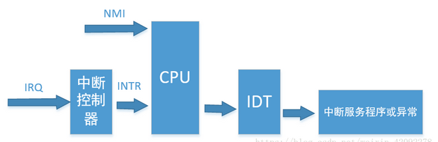
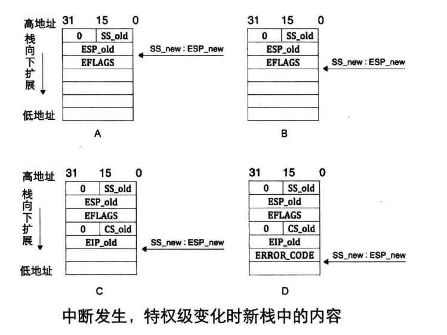
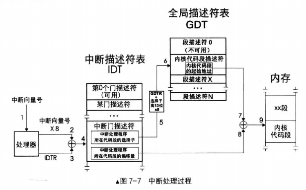
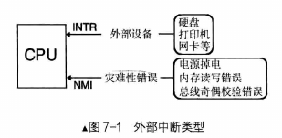
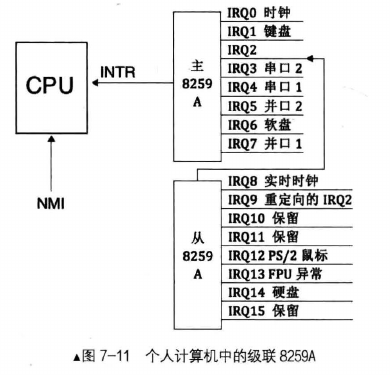
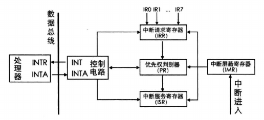

# 中断

[中断原理详解](https://blog.csdn.net/yusiguyuan/article/details/23698025)

## 小知识点

[中断向量表和中断描述符表IDT](https://blog.csdn.net/yxc135/article/details/8734452)

- 中断过程：一个中断源会产生一个中断向量，一个向量对应中断描述符表中的一个门描述符，通过该描述符找到对应的中断处理程序。（中断发生时，eflags 的 NT & TF 位被置为 0 ；中断返回为 iret）

- 中断向量表 （IVT）：由于 IVT 是在**实模式**下存储中断处理程序入口的表。因此在实模式中固定在 0~0x3ff(1024个字节)

- 中断向量：4 字节，因此 IVT 中有 256 个中断向量

- 中断描述符表：位置不固定，由 IDTR 存储位置。 （保护模式）

- 中断描述符：8 字节

- 中断发生时的压栈：先判断 特权级，（若特权级发生变化，需要保存 旧ss 和 esp 值），再压入 eflags, cs, eip, error_code。 

- Linux 除了在刚开始加载内核时需要用到 BIOS 提供的显示和磁盘读操作中断功能，在内核正常运行之前则会在 setup.s 程序中重新初始化 8259A 芯片并且在 head.s 程序中重新设置一张中断向量表（中断描述符表）。完全抛弃了BIOS所提供的中断服务功能（IVT）。

- cli 关中断、sti 开中断（对于 flags 中的 IF 位）、iret 专门用于中断返回

- 中断描述符表初始化需要经过两个过程：

  a.第一次初始化：用setup_idt()函数填充中断描述符表中的256个表项，填充时使用一个空的中断处理程序。因为现在还是在初始化阶段，还没有任何中断处理程序，因此，用这个空的中断处理程序来填充每个表项

  b.第二次初始化：内核在启用分页功能后对IDT进行第二次初始化。

-----------


## 中断分类

在计算机系统中，根据中断源的不同，通常将中断分为两大类：

1. 外部中断：又称硬件中断，主要分为两种：可屏蔽中断、非屏蔽中断。

2. 内部中断

### **外部中断**

> 可屏蔽中断：
>
> 1. 常由计算机的外设或一些接口功能产生，如键盘、打印机、串行口等
> 2. 这种类型的中断可以在CPU要处理其它紧急操作时，被软件屏蔽或忽略

> 非屏蔽中断：
>
> 1. 由意外事件导致，如电源断电、内存校验错误等
> 2. 对于这种类型的中断事件，无法通过软件进行屏蔽，CPU必须无条件响应

### 内部中断：软中断 + 异常

异常：Fault、Trap、Abort


## 中断的上半部和下半部

由于中断会打断内核中进程的正常调度运行，所以要求中断服务程序尽可能的短小精悍；但是在实际系统中，当中断到来时，要完成工作往往进行大量的耗时处理。因此期望让中断处理程序运行得快，并想让它完成的工作量多，这两个目标相互制约，诞生——上/下半部机制。

上半部——接受中断，它就立即开始执行，但只有做严格时限的工作。能够被允许稍后完成的工作会推迟到底半部去，此后，在合适的时机，底半部会被开中断执行。上半部简单快速，执行时禁止一些或者全部中断。

底半部稍后执行，而且执行期间可以响应所有的中断（即打开所有中断）。这种设计可以使系统处于中断屏蔽状态的时间尽可能的短，以此来提高系统的响应能力。上半部只有中断处理程序机制，而下半部的实现有软中断，tasklet和工作队列实现。


## 中断处理流程

CPU处理流程主要有6个步骤：

1. 确定中断或异常的中断向量 
2. 通过 IDTR 寄存器找到 IDT 
3. 特权检查 （CPL DPL）
4. 特权级发生变化，进行堆栈切换 
5. 如果是异常将异常代码压入堆栈，如果是中断则关闭可屏蔽中断 
6. 进入中断或异常服务程序执行。通过 GDT 找到相应程序。



### 堆栈的切换

拿 CPL 与 中断描述符的 DPL 进行对比

 CPU自动压入： 

```
  ss         运行级别提升时需切换堆栈，因此多压入用户态的栈段ss， 
  esp      运行级别提升时需切换堆栈，因此多压入用户态的堆栈指针esp， 
  eflags 
  cs 
  eip 
  error code
```




### 通过 IDT 找到中断处理程序



> **IRQ编号**
>
> 系统中每一个注册的中断源，都会分配一个唯一的编号用于识别该中断，我们称之为IRQ编号。IRQ编号贯穿在整个Linux的通用中断子系统中
>
> **外部中断**正是通过 INTR 和 NMI 两条信号线通知 CPU
>
> 


## 8259A 可编程中断控制控制器 

8259A 为两个芯片级联，共有 16 个IRQ 接口，由于从片连接主片需要一个接口，因此 8259A 共支持 15 个中断接口。



8259A 的工作流程如下图

- IRR：等待队列
- PR：判决优先级器——IRQ 的接口号越大，优先级越高。
- ISR ：某个中断正在被处理时，保存在此处



## 中断排队和中断判优

　　1. 中断申请是随机的，有时会出现多个中断源同时提出中断申请。

　　2. CPU 每次只能响应一个中断源的请求。

　　3. CPU 不可能对所有中断请求一视同仁，它会根据各中断源工作性质的轻重缓急，预先安排一个优先级顺序。当多个中断源同时申请中断时，即按此优先级顺序进行排队，等候CPU处理。

> 举个栗子
>
> 了解了CPU中断处理的过程，就不难理解下面一种常见的情景：
>
> ​	正在拷贝文件时，往某个文本框输入信息，这个文本框会出现短暂的假死，键盘输入的数据不能及时显示在文本框中，需要等一会儿才能逐渐显示出来。
>
> ​	这是因为该中断操作(往文本框输入信息)在中断队列的优先级比较低，或者 CPU 认为正在处理的操作(拷贝文件)进行挂起的代价太大，所以只有等到 CPU 到了一个挂起代价较低的点，才会挂起当前操作，处理本次中断信息。


## **LINUX信号机制**

 **信号本质**

**信号是异步的进程间通讯机制,是在软件层次上对中断机制的一种模拟**，在原理上，一个进程收到一个信号与处理器收到一个中断请求可以说是一样的。信号是异步的，一个进程不必通过任何操作来等待信号的到达，事实上，进程也不知道信号到底什么时候到达。
**信号是进程间通信机制中唯一的异步通信机制**，可以看作是异步通知，通知接收信号的进程有哪些事情发生了。内核也可以因为内部事件而给进程发送信号，通知进程发生了某个事件。注意，信号只是用来通知某进程发生了什么事件，并不给 该进程传递任何数据。

 **产生信号的条件主要有：**

1. 用户在终端 按下某些键时，终端驱动程序会发送信号给前台进程，例如Ctrl-C产生SIGINT信 号，Ctrl-/产生SIGQUIT信号，Ctrl-Z产生SIGTSTP信号。

2. 硬件异常产生信号，这些条件由硬件检测到并通知内核，然后内核向当前进程发送适当的信号。例如当前进程执行了 除以0的指令，CPU的运算单元会产生异常，内核将这个异常解释为SIGFPE信号发送给进 程。再比如当前进程访问了非法内存地址，，MMU会产生异常，内核将这个异常解释为SIGSEGV信 号发送给进程。

3. 一个进程调用kill(2)函数可以发送信号给另一个进程。

4. 可以用kill(1)命令发送信号给某个 进程，kill(1)命令也是调用kill(2)函 数实现的，如果不明确指定信号则发送SIGTERM信号，该信号的默认处理动作是终止进程。

5. 当 内核检测到某种软件条件发生时也可以通过信号通知进程，例如闹钟超时产生SIGALRM信 号，向读端已关闭的管道写数据时产生SIGPIPE信号


**信号与中断的相似点：**
 （1）采用了相同的异步通信方式；
 （2）当检测出有信号或中断请求时，都暂停正在执行的程序而转去执行相应的处理程序；
 （3）都在处理完毕后返回到原来的断点；
 （4）对信号或中断都可进行屏蔽。

 **信号与中断的区别：**
 （1）中断有优先级，而信号没有优先级，所有的信号都是平等的；
 （2）信号处理程序是在用户态下运行的，而中断处理程序是在核心态下运行；
 （3）中断响应是及时的，而信号响应通常都有较大的时间延迟。


