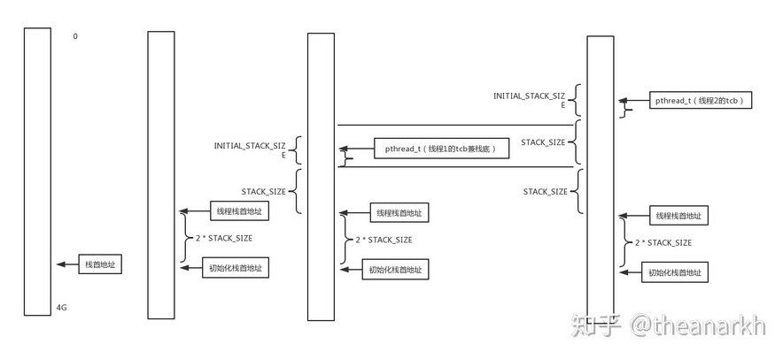
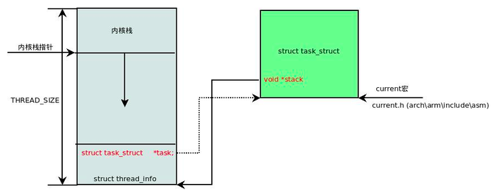

### 任务列表

 Linux 内核也应该先弄一个**链表**，将所有的 task_struct 串起来。


### task_struct 结构图

位于 /include/linux/sched.h


## task_struct

同样在 Linux 里面，无论是进程，还是线程，到了内核里面，我们统一都叫任务（Task），由一个统一的结构**task_struct**进行管理。

### 1、任务 ID

```c
pid_t pid;
pid_t tgid;
struct task_struct *group_leader; 
```

**区别 task_struct:**  pid 是 process id，tgid 是 thread group ID。

任何一个进程，如果只有主线程，那 pid 是自己，tgid 是自己，group_leader 指向的还是自己。

如果一个进程创建了其他线程，那就会有所变化了。线程有自己的 pid，tgid 就是进程的主线程的 pid，group_leader 指向的就是进程的主线程。

**有了 tgid，我们就知道 tast_struct 代表的是一个进程还是代表一个线程了。**


### 2、任务状态


TASK_RUNNING 并不是说进程正在运行，而是表示进程在时刻准备运行的状态。当处于这个状态的进程获得时间片的时候，就是在运行中；如果没有获得时间片，就说明它被其他进程抢占了，在等待再次分配时间片。


一旦一个进程要结束，先进入的是 EXIT_ZOMBIE 状态，但是这个时候它的父进程还没有使用 wait() 等系统调用来获知它的终止信息，此时进程就成了僵尸进程。


### 3、运行统计信息

作为项目经理，你肯定需要了解项目的运行情况。例如，有的员工很长时间都在做一个任务，这个时候你就需要特别关注一下；再如，有的员工的琐碎任务太多，这会大大影响他的工作效率。

那如何才能知道这些员工的工作情况呢？在进程的运行过程中，会有一些统计量，具体你可以看下面的列表。**这里面有进程在用户态和内核态消耗的时间、上下文切换的次数等等。**

```

u64				utime;// 用户态消耗的 CPU 时间

u64				stime;// 内核态消耗的 CPU 时间

unsigned long			nvcsw;// 自愿 (voluntary) 上下文切换计数

unsigned long			nivcsw;// 非自愿 (involuntary) 上下文切换计数

u64				start_time;// 进程启动时间，不包含睡眠时间

u64				real_start_time;// 进程启动时间，包含睡眠时间
```


### 4、进程亲缘关系

从我们之前讲的创建进程的过程，可以看出，任何一个进程都有父进程。所以，整个进程其实就是一棵进程树。而拥有同一父进程的所有进程都具有兄弟关系。


### 5、信号处理


### 内存管理

每个进程都有自己独立的虚拟内存空间，这需要有一个数据结构来表示，就是 mm_struct。

详情见作者所总结的几个Blog

```
struct mm_struct                *mm;
struct mm_struct                *active_mm;
```


### 文件与文件系统

每个进程有一个文件系统的数据结构，还有一个打开文件的数据结构。这个放到文件系统详细讲述。

```

/* Filesystem information: */

struct fs_struct                *fs;

/* Open file information: */

struct files_struct             *files;
```


> 【扩展阅读】：如何确认进程栈的大小
>
> 我们要知道栈的大小，那必须得知道栈的起始地址和结束地址。**栈起始地址** 获取很简单，只需要嵌入汇编指令获取栈指针 esp 地址即可。**栈结束地址** 的获取有点麻烦，我们需要先利用递归函数把栈搞溢出了，然后再 GDB 中把栈溢出的时候把栈指针 esp 打印出来即可。代码如下：

```C
/* file name: stacksize.c */

void *orig_stack_pointer;

void blow_stack() {
    blow_stack();
}

int main() {
    __asm__("movl %esp, orig_stack_pointer");

    blow_stack();
    return 0;
}
```

```shell
$ g++ -g stacksize.c -o ./stacksize
$ gdb ./stacksize
(gdb) r
Starting program: /home/home/misc-code/setrlimit

Program received signal SIGSEGV, Segmentation fault.
blow_stack () at setrlimit.c:4
4       blow_stack();
(gdb) print (void *)$esp
$1 = (void *) 0xffffffffff7ff000
(gdb) print (void *)orig_stack_pointer
$2 = (void *) 0xffffc800
(gdb) print 0xffffc800-0xff7ff000
$3 = 8378368    // Current Process Stack Size is 8M
```


## 大牛讲解

[栈的三种解释)](http://www.ruanyifeng.com/blog/2013/11/stack.html)

[Linux 中的各种栈：进程栈 线程栈 内核栈 中断栈](https://blog.csdn.net/yangkuanqaz85988/article/details/52403726)

### 进程栈

进程栈是属于用户态栈，和进程 **虚拟地址空间 (Virtual Address Space)** 密切相关。


> 【扩展阅读】：进程栈的动态增长实现
>
> 进程在运行的过程中，通过不断向栈区压入数据，当超出栈区容量时，就会耗尽栈所对应的内存区域，这将触发一个 **缺页异常 (page fault)**。通过异常陷入内核态后，异常会被内核的 `expand_stack()` 函数处理，进而调用 `acct_stack_growth()` 来检查是否还有合适的地方用于栈的增长。
>
> 如果栈的大小低于 `RLIMIT_STACK`（通常为8MB），那么一般情况下栈会被加长，程序继续执行，感觉不到发生了什么事情，这是一种将栈扩展到所需大小的常规机制。然而，如果达到了最大栈空间的大小，就会发生 **栈溢出（stack overflow）**，进程将会收到内核发出的 **段错误（segmentation fault）** 信号。
>
> 动态栈增长是唯一一种访问未映射内存区域而被允许的情形，其他任何对未映射内存区域的访问都会触发页错误，从而导致段错误。一些被映射的区域是只读的，因此企图写这些区域也会导致段错误。

### 线程栈

[线程的栈](https://zhuanlan.zhihu.com/p/86219708)

> 主线程的线程栈在内核空间位置附近，大小为8MB，其他线程的线程栈是主线程在调用pthread_create创建线程时，由mmap分配的，所以这些线程栈在mmap的区域内，跟共享库入口同属一个区域，phtread_t tid中存储的就是线程结构体在mmap区域中的入口。

线程本质上是进程中的一个执行流，我们知道，进程有代码段，线程其实就是进程代码段中的其中一段代码。线程的一种实现是作为进程来实现的。通过调用 clone ，新建一个进程，然后执行父进程代码段里的一个代码片段。文件、内存等信息都是共享的。因为内存是共享的，所以线程不能共享栈，否则访问栈的地址的时候，会映射到相同的物理地址，那样就会互相影响，所以每个线程会有自己独立的栈。在调用clone函数的时候会设置栈的范围。

新建的线程的栈在主线程的栈顶下面（即地址小于主线程的栈顶），创建线程的时候，**首先计算新线程的栈地址，然后调用mmap划出这块地址。**



从 Linux 内核的角度来说，其实它并没有线程的概念。Linux 把所有线程都当做进程来实现，它将线程和进程不加区分的统一到了  task_struct 中。线程仅仅被视为一个与其他进程共享某些资源的进程，而是否共享地址空间几乎是进程和 Linux 中所谓线程的唯一区别。

由于线程的 `mm->start_stack` 栈地址和所属进程相同，所以线程栈的起始地址并没有存放在 `task_struct` 中，应该是使用 `pthread_attr_t` 中的 `stackaddr` 来初始化 `task_struct->thread->sp`（sp 指向 `struct pt_regs` 对象，该结构体用于保存用户进程或者线程的寄存器现场）。

**线程栈不能动态增长，一旦用尽就没了，这是和生成进程的 fork 不同的地方**。由于线程栈是从进程的地址空间中 map 出来的一块内存区域，原则上是线程私有的。但是同一个进程的所有线程生成的时候浅拷贝生成者的 task_struct 的很多字段，其中包括所有的 `vma`，如果愿意，其它线程也还是可以访问到的，于是一定要注意。

#### 问题

**为什么需要单独的线程栈？**

Linux  调度程序中并没有区分线程和进程，当调度程序需要唤醒”进程”的时候，必然需要恢复进程的上下文环境，也就是进程栈；但是线程和父进程完全共享一份地址空间，如果栈也用同一个那就会遇到以下问题。假如进程的栈指针初始值为 0x7ffc80000000；父进程 A 先执行，调用了一些函数后栈指针 esp 为  0x7ffc8000FF00，此时父进程主动休眠了；接着调度器唤醒子线程 A1： 

- 此时 A1 的栈指针 esp 如果为初始值 0x7ffc80000000，则线程 A1 一但出现函数调用，必然会破坏父进程 A 已入栈的数据。
- 如果此时线程 A1 的栈指针和父进程最后更新的值一致，esp 为 0x7ffc8000FF00，那线程 A1 进行一些函数调用后，栈指针 esp 增加到  0x7ffc8000FFFF，然后线程 A1 休眠；调度器再次换成父进程 A 执行，那这个时候父进程的栈指针是应该为  0x7ffc8000FF00 还是 0x7ffc8000FFFF 呢？无论栈指针被设置到哪个值，都会有问题不是吗？


> #### 延伸
>
> [用户态线程栈和内核态线程栈](https://www.zhihu.com/question/323415592)
>
> 单线程模型里，函数调用是怎么回事呢？
> 很简单，通过CPU直接支持的栈区，自动维护“函数调用链”。只要维护好这个调用链信息，程序就可以有条不紊的按设计预想执行了。
>
> 我们很容易想到：如果我**另外再申请一块内存**，把它的起始地址放进CPU的堆栈寄存器；那么，是不是就可以用这块地址另外维护一条调用链了呢？
> —— 这就是线程的原理。
>
> 所谓“新开一条线程”，实质上就是另外申请了一块内存，然后把这块内存当作堆栈，维护另外一条调用链。
>
> 如果维护调用链（以及执行现场）的任务全部放在用户空间，不让操作系统知道，这就叫“用户态线程”。反之，如果操作系统自己提供了开辟新线程以及维护它的调用链的一整套方法，这就叫“内核态线程”。
>
> 但在内存空间使用上，两者并无根本区别：它们都是另外申请了一块空间用作堆栈，然后像传统的单线程程序一样，用这个堆栈维护调用链（以及局部变量等信息）。
>
> 因此：
>
> - 用户态线程的实现：可以认为和new/malloc得到的内存一样，只是拿来当栈用了而已，属于 mmap
> - 内核态线程，便是在内核栈中进行分配。


### 进程内核栈

在用户态中，程序的执行往往是一个函数调用另一个函数。下图为用户态函数栈


当通过系统调用进入内核后，内核中也有各种各样的函数调用来调用去的，也需要这样一个机制，这该怎么办呢？

Linux 给**每个 task** 都分配了内核栈。在每一个进程的生命周期中，必然会通过到系统调用陷入内核。在执行系统调用陷入内核之后，这些内核代码所使用的栈并不是原先进程用户空间中的栈，而是一个单独内核空间的栈，这个称作进程内核栈。

进程内核栈在进程创建的时候，通过 slab 分配器从 `thread_info_cache` 缓存池中分配出来，其大小为 `THREAD_SIZE`，一般来说是一个页大小 4K；

**下面的 stack 便是进程内核栈**

```c
struct task_struct {
	volatile long state;	/* -1 unrunnable, 0 runnable, >0 stopped */
	void *stack;
	...
	}
```


在 32 位系统上 arch/x86/include/asm/page_32_types.h，是这样定义的：一个 PAGE_SIZE 是 4K，左移一位就是乘以 2，也就是 8K。Linux 给每个 task 都分配了内核栈。

```
#define THREAD_SIZE_ORDER	1
#define THREAD_SIZE		(PAGE_SIZE << THREAD_SIZE_ORDER)
```

一个 PAGE_SIZE 是 4K，左移一位就是乘以 2，也就是 8K。

```c
struct task_struct {
	volatile long state;	/* -1 unrunnable, 0 runnable, >0 stopped */
	void *stack;
	...
	}
```



内核将内核栈的头部一段空间，用于存放 `thread_info` 结构体，而此结构体中则记录了对应进程的描述符。

#### thread_info 结构

这个结构是对 task_struct 结构的补充。因为 task_struct 结构庞大但是通用，不同的体系结构就需要保存不同的东西，所以往往与体系结构有关的，都放在 thread_info 里面。

在内核代码里面有这样一个 union，将 thread_info 和 stack 放在一起

` 位于 /include/linux/sched.h `

```c
union thread_union {
	struct thread_info thread_info;
	unsigned long stack[THREAD_SIZE/sizeof(long)];
};
```

在内核栈的最高地址端，存放的是另一个结构 pt_regs

```c
#ifdef __i386__
struct pt_regs {
	unsigned long bx;
	unsigned long cx;
	unsigned long dx;
	unsigned long si;
	unsigned long di;
	unsigned long bp;
	unsigned long ax;
	unsigned long ds;
	unsigned long es;
	unsigned long fs;
	unsigned long gs;
	unsigned long orig_ax;
	unsigned long ip;
	unsigned long cs;
	unsigned long flags;
	unsigned long sp;
	unsigned long ss;
};
```

**当系统调用从用户态到内核态的时候，首先要做的第一件事情，就是将用户态运行过程中的 CPU 上下文保存起来，其实主要就是保存在这个结构的寄存器变量里。这样当从内核系统调用返回的时候，才能让进程在刚才的地方接着运行下去。**


### 通过 task_struct 找内核栈

如果有一个 task_struct 的 stack 指针在手，可以通过下面的函数找到这个线程内核栈：

```c
static inline void *task_stack_page(const struct task_struct *task) {
	return task->stack;
}
```

再通过 内核栈的开始位置，加上 THREAD_SIZE 到 pg_regs 的末尾处， 再转换为

```c
#define task_pt_regs(task) \
({									\
	unsigned long __ptr = (unsigned long)task_stack_page(task);	\
	__ptr += THREAD_SIZE - TOP_OF_KERNEL_STACK_PADDING;		\
	((struct pt_regs *)__ptr) - 1;					\
})
```

先从


### 通过内核栈找 task_struct

 thread_info 中有个成员变量 task 指向 task_struct，所以我们常用 current_thread_info()->task 来获取 task_struct。

```c
struct thread_info {
	struct task_struct	*task;		/* main task structure */
	__u32			flags;		/* low level flags */
	__u32			status;		/* thread synchronous flags */
	__u32			cpu;		/* current CPU */
	mm_segment_t		addr_limit;
	unsigned int		sig_on_uaccess_error:1;
	unsigned int		uaccess_err:1;	/* uaccess failed */
};
```

这是之前的机制。

现在是每个 CPU 运行的 task_struct 不通过 thread_info 获取了，而是直接放在 Per CPU 变量里面了。

Per CPU 变量是内核中一种重要的同步机制。顾名思义，Per CPU 变量就是为每个 CPU 构造一个变量的副本，这样多个 CPU 各自操作自己的副本，互不干涉。比如，当前进程的变量 current_task 就被声明为 Per CPU 变量。（HuSharpOS 类似 就是 current_thread)


- 系统刚刚初始化的时候，current_task 都指向 init_task。

- 当某个 CPU 上的进程进行切换的时候，current_task 被修改为将要切换到的目标进程。例如，进程切换函数 __switch_to 就会改变 current_task。

  ```c
  __switch_to(struct task_struct *prev_p, struct task_struct *next_p) {
  ......
  this_cpu_write(current_task, next_p);
  ......
  return prev_p;
  }
  ```

- 当要获取当前的运行中的 task_struct 的时候，就需要调用 this_cpu_read_stable 进行读取。

```c
#define this_cpu_read_stable(var)       percpu_stable_op("mov", var)
```


#### 问题

**进程和线程是否共享一个内核栈？**

- No，线程和进程创建的时候都调用 `dup_task_struct` 来创建 task 相关结构体，而内核栈也是在此函数中 `alloc_thread_info_node` 出来的。因此虽然线程和进程共享一个地址空间 `mm_struct`，但是并不共享一个内核栈。


### 中断栈

进程陷入内核态的时候，需要内核栈来支持内核函数调用。中断也是如此，当系统收到中断事件后，进行中断处理的时候，也需要中断栈来支持函数调用。由于系统中断的时候，系统当然是处于内核态的，所以中断栈是可以和内核栈共享的。但是具体是否共享，这和具体处理架构密切相关。


intr_stack 用于存储进入中断时任务的上下文（相当于 中断栈）

- intr%1entry 执行的保存程序上下文环境的一系列 push 都是压入此结构
- intr_exit 是该栈的 pop 
- 位于 PCB 所在最顶端

thread_stack 用于存储中断处理程序中，任务切换 (switch_to )的上下文。（相当于 Linux 中的线程栈）

- 此栈用来保存待运行的函数
- 发生任务切换时，eip 用于保存切换任务后新任务的返回地址


## 栈和堆

它们的主要区别是：stack是有结构的，每个区块按照一定次序存放，可以明确知道每个区块的大小；heap是没有结构的，数据可以任意存放。因此，stack的寻址速度要快于heap。

其他的区别还有，一般来说，每个线程分配一个stack，每个进程分配一个heap，也就是说，stack是线程独占的，heap是线程共用的。此外，stack创建的时候，大小是确定的，数据超过这个大小，就发生stack overflow错误，而heap的大小是不确定的，需要的话可以不断增加。

根据上面这些区别，数据存放的规则是：只要是局部的、占用空间确定的数据，一般都存放在stack里面，否则就放在heap里面。


